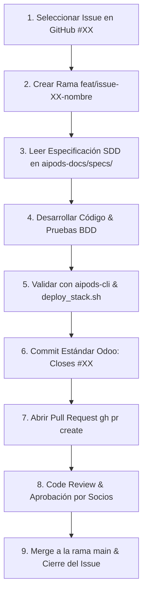

# 🚀 Guía de Onboarding & Flujo de Trabajo Git PR (Pull Requests)

**AI Pods Enterprise SaaS Platform**  
*Documentación Oficial para Desarrolladores y Socios de Proyecto*

---

## 📋 1. Requisitos Previos del Entorno

Antes de comenzar a programar, asegúrate de tener instaladas las siguientes herramientas en tu entorno Linux / macOS / WSL:

| Herramienta | Versión Mínima | Propósito |
| :--- | :--- | :--- |
| **Go** | `1.22+` | Compilación y ejecución del Engine Core (`aipods-core-engine`) |
| **Node.js & npm** | `18+` / `9+` | Ejecución de los Frontends React/Vite y automatización RPA |
| **Git** | `2.34+` | Control de versiones distribuido |
| **GitHub CLI (`gh`)** | `2.20+` | Gestión de Issues y Pull Requests desde la consola |
| **gosec AST Scanner** | `v2+` | Scanner de vulnerabilidades en Go (`go install github.com/securego/gosec/v2/cmd/gosec@latest`) |

---

## 📂 2. Onboarding & Clonado de Repositorios

Para que los scripts de automatización funcionen correctamente, los 4 repositorios de la organización deben clonarse dentro de una **misma carpeta contenedora** (ej. `~/server/` o `~/projects/aipods/`):

```bash
# Crear directorio raíz de trabajo
mkdir -p ~/server && cd ~/server

# Clonar los 4 repositorios oficiales de la organización
git clone https://github.com/onlyone-ai-pods/aipods-docs.git
git clone https://github.com/onlyone-ai-pods/aipods-core-engine.git
git clone https://github.com/onlyone-ai-pods/aipods-frontend-customer.git
git clone https://github.com/onlyone-ai-pods/aipods-frontend-admin.git
```

---

## 🛠️ 3. Scripts de Automatización Local (`aipods-docs/scripts/`)

Dentro del repositorio `aipods-docs/scripts/` dispones de 4 scripts bash que automatizan el análisis de calidad, el arranque, las pruebas E2E y la detención del entorno:

### 3.1 Script Maestro de Auditoría y Verificación (`deploy_stack.sh`)
Verifica la estructura de los 4 repositorios, ejecuta `go vet`, `gosec`, `go test` y los linters ESLint en los frontends:

```bash
bash aipods-docs/scripts/deploy_stack.sh
```

### 3.2 Iniciador del Stack Local en Segundo Plano (`start_local_stack.sh`)
Levanta el Engine Go en el puerto `8080`, el Portal de Clientes en el puerto `3000` y el Admin Hub en el puerto `3001` con guardado de logs en `logs_local/`:

```bash
bash aipods-docs/scripts/start_local_stack.sh
```

### 3.3 Suite de Pruebas Funcionales E2E (`test_functional_e2e.sh`)
Ejecuta 5 pruebas HTTP automatizadas contra los endpoints REST (`/healthz`, `/sandbox/sessions`, `/sandbox/query`, `/rag/ingest`, `/pods/register`):

```bash
bash aipods-docs/scripts/test_functional_e2e.sh
```

### 3.4 Detención del Stack Local (`stop_local_stack.sh`)
Detiene limpiamente todos los procesos de Go y Vite en ejecución:

```bash
bash aipods-docs/scripts/stop_local_stack.sh
```

---

## 🔄 4. Flujo de Trabajo Git: Issues, Feature Branches & Pull Requests (PRs)

Seguimos una metodología **Spec-Driven Development (SDD)** estricta. Todo cambio de código debe responder a un **Issue registrado en GitHub** y fusionarse mediante un **Pull Request (PR)** aprobado.



---

### Paso a Paso para Trabajar en un Issue:

#### 📌 Paso 1: Seleccionar el Issue
Consulta el roadmap de issues en `aipods-docs/specs/02_security_and_compliance/25_governance_issues_roadmap_spec.md` o ejecuta:

```bash
gh issue list --repo onlyone-ai-pods/aipods-docs
```

#### 🌿 Paso 2: Crear la Rama de Trabajo (Feature Branch)
Usa el prefijo `feat/` o `fix/` seguido del número de issue:

```bash
cd aipods-core-engine
git checkout main
git pull origin main
git checkout -b feat/issue-01-cifrado-qdrant
```

#### 📜 Paso 3: Desarrollar con Criterios SDD / BDD
Lee la especificación correspondiente en `aipods-docs/specs/`. Asegúrate de implementar la interfaz `pod.BaseAIPod` y los escenarios Gherkin del issue.

#### 🛡️ Paso 4: Ejecutar los Quality Gates Locales
Antes de enviar el código, asegúrate de que pasa el scanner AST sin vulnerabilidades:

```bash
# Usando aipods-cli
aipods-cli validate --path=. --strict

# O ejecutando el script global
bash ../aipods-docs/scripts/deploy_stack.sh
```

#### 💾 Paso 5: Commit con Convención Odoo / Git Standard
El mensaje del commit debe usar las etiquetas oficiales `[FEAT]`, `[FIX]`, `[IMP]` o `[ADD]` e incluir el cierre del issue:

```bash
git add .
git commit -m "[FEAT] security: implement AES-256 GCM encryption at rest for Qdrant. Closes #1"
```

#### 🚀 Paso 6: Enviar el Pull Request (PR)
Sube tu rama al repositorio remoto y abre el PR en GitHub:

```bash
# Push de la rama remota
git push origin feat/issue-01-cifrado-qdrant

# Crear el Pull Request usando la CLI de GitHub
gh pr create \
  --repo onlyone-ai-pods/aipods-core-engine \
  --title "[FEAT] Cifrado At-Rest de Embeddings en Qdrant (AES-256 GCM)" \
  --body "Implementa la encriptación AES-256 GCM según SPEC-CORE-01. Resuelve Issue #1." \
  --base main \
  --head feat/issue-01-cifrado-qdrant
```

#### 👁️ Paso 7: Revisión por Pares (Code Review) & Merge
1. Los socios/revisores analizan el diff del PR.
2. Si los tests automáticos pasan y el código cumple con SDD, se aprueba el PR.
3. Se realiza **Squash and Merge** hacia `main` y GitHub cierra automáticamente el Issue asociado.

---

## 🎯 Resumen de Comandos Frecuentes

```bash
# Probar el stack entero
bash aipods-docs/scripts/deploy_stack.sh

# Levantar servidores locales
bash aipods-docs/scripts/start_local_stack.sh

# Probar la API localmente
bash aipods-docs/scripts/test_functional_e2e.sh

# Apagar servidores
bash aipods-docs/scripts/stop_local_stack.sh

# Validar tu Pod antes del PR
aipods-cli validate --path=./mi_pod --strict
```
