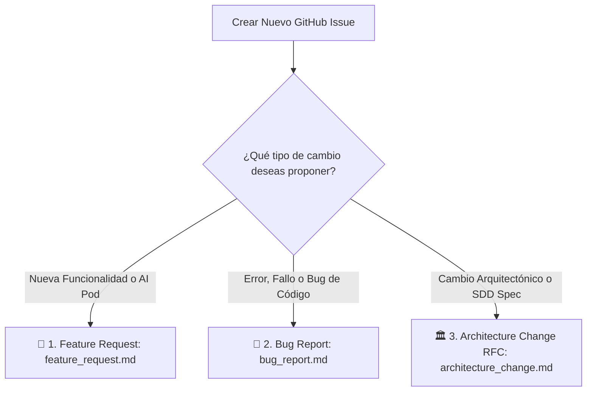

# 📖 Guía Oficial de Creación y Gobernanza de GitHub Issues

**Organización:** AI Pods Enterprise SaaS Platform  
**Repositorio Central de Documentación:** `onlyone-ai-pods/aipods-docs`  
**Versión:** `16.0.0`  

---

## 🏛️ 1. Filosofía de Gobernanza de Issues

En el modelo **Spec-Driven Development (SDD)** de AI Pods Enterprise, ningún código se escribe sin un requerimiento documentado. Los GitHub Issues son el **punto de entrada oficial** para todas las ideas, correcciones, mejoras de seguridad y nuevos AI Pods.

---

## 🎯 2. Las 3 Plantillas Oficiales de Issues

Al hacer clic en **"New Issue"** en el repositorio, debes seleccionar una de las siguientes 3 plantillas:



---

## 🏷️ 3. Convención de Títulos y Etiquetas (Labels)

### Format del Título del Issue:
```text
[TIPO] <Nombre descriptivo corto en formato Kebab/Title Case>
```

* **`[FEAT]`**: Solicitud de nueva característica o nuevo AI Pod.
* **`[BUG]`**: Reporte de fallo o ruptura de contrato de API.
* **`[ARCH]`**: Propuesta de cambio o actualización en especificaciones SDD.

### Matriz de Etiquetas Oficiales:

| Etiqueta (Label) | Color Hex | Propósito & Uso |
| :--- | :--- | :--- |
| `feature` | `#a2eeef` | Solicitud de nueva funcionalidad. |
| `bug` | `#d73a4a` | Reporte de error o falla de código. |
| `architecture` | `#0075ca` | Propuesta de cambio de arquitectura o RFC. |
| `needs-spec` | `#d4c5f9` | Requerimiento aprobado que necesita su Spec SDD. |
| `spec-approved` | `#0e8a16` | Especificación integrada en `specs/`. |
| `pod-core` | `#1d76db` | Afecta el motor backend Go Core Engine. |
| `pod-essential` | `#b60205` | AI Pod esencial para cobro, seguridad o fiscalidad SaaS. |
| `pod-dynamic` | `#fbca04` | AI Pod de dominio opcional (carga dinámicamente). |
| `frontend-customer` | `#0052cc` | Afecta el Portal de Clientes React 18. |
| `frontend-admin` | `#5319e7` | Afecta el Admin Review Hub React 18. |

---

## 📋 4. Estructura Obligatoria de Criterios de Aceptación (Gherkin BDD)

Todo Issue DEBE incluir criterios de aceptación redactados en formato **Gherkin BDD**:

```gherkin
Feature: <Nombre de la Característica>

  Scenario: <Nombre del Escenario Exitoso o de Falla>
    Given <contexto o estado previo del sistema>
    When <accion realizada por el usuario o sistema>
    Then <resultado o comportamiento esperado>
    And <condicion adicional obligatoria>
```

---

## 🛠️ 5. Comandos Rápidos con GitHub CLI (`gh issue`)

```bash
# Crear Issue de Feature
gh issue create --repo onlyone-ai-pods/aipods-docs \
  --title "[FEAT] <Nombre>" \
  --label "feature,needs-spec"

# Crear Issue de Bug
gh issue create --repo onlyone-ai-pods/aipods-docs \
  --title "[BUG] <Descripcion del Error>" \
  --label "bug,pod-core"
```
