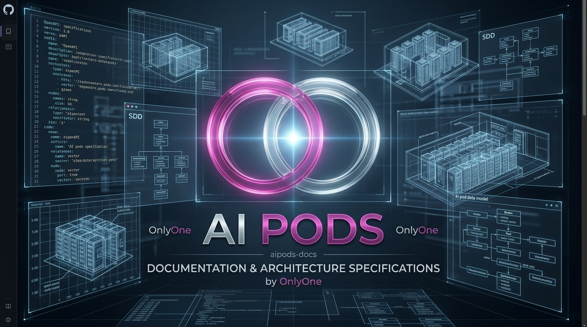

<p align="center">
  
</p>

# 📜 AI Pods Enterprise SaaS Platform — Documentación & Gobernanza SDD

[](https://github.com/onlyone-ai-pods/aipods-docs)
[](https://github.com/onlyone-ai-pods/aipods-docs)
[](https://github.com/onlyone-ai-pods/aipods-docs)
[](https://github.com/onlyone-ai-pods/aipods-core-engine)

Este repositorio contiene la fuente autoritativa de documentación, especificaciones ejecutables SDD (Spec-Driven Development), catálogo de Agentic Skills y contratos OpenAPI para la plataforma **AI Pods Enterprise SaaS Platform**.

---

## 🏛️ Repositorios Segregados del Ecosistema

1. 📜 **`aipods-docs`** (`/home/martin/server/aipods-docs`): Especificaciones ejecutables SDD, Skills Kit Maestro, OpenAPI y Gobernanza.
2. 🌐 **`aipods-core-engine`** (`/home/martin/server/aipods-core-engine`): Motor Backend en Go 1.22+, Swarm Protocol, Saga Pattern y Vector DB.
3. 🖥️ **`aipods-frontend-customer`** (`/home/martin/server/aipods-frontend-customer`): Portal de Clientes React 18 / Vite (Puerto `3000`).
4. 🛡️ **`aipods-frontend-admin`** (`/home/martin/server/aipods-frontend-admin`): Admin Review Hub & Senior Consultant Portal React 18 / Vite (Puerto `3001`).

---

## 📚 Arquitectura Documental Consolidada (ISO/IEC 26514 & ISO 9001:2015 7.5.3)

- 📄 **[`specs/SPEC_MASTER_INDEX.md`](file:///home/martin/server/aipods-docs/specs/SPEC_MASTER_INDEX.md):** Índice Maestro Dinámico de Especificaciones SDD.
- 📂 **[`specs/01_CORE_ENGINE_MASTER_SPEC.md`](file:///home/martin/server/aipods-docs/specs/01_CORE_ENGINE_MASTER_SPEC.md):** Especificación Maestra de Backend Go, Swarm Protocol, Saga Pattern & CMMI Level 4.
- 📂 **[`specs/02_SECURITY_AND_COMPLIANCE_MASTER_SPEC.md`](file:///home/martin/server/aipods-docs/specs/02_SECURITY_AND_COMPLIANCE_MASTER_SPEC.md):** Especificación Maestra de ISO 9001, SOC 2, Vault AES-256 e IP Audit Trail.
- 📂 **[`specs/03_ADMIN_HUB_GOVERNANCE_MASTER_SPEC.md`](file:///home/martin/server/aipods-docs/specs/03_ADMIN_HUB_GOVERNANCE_MASTER_SPEC.md):** Especificación Maestra de Admin Hub, 5 Pestañas Modulares, Sub-Sidebar Tablets 8"+ & Full-Width 100%.
- 📂 **[`specs/04_CUSTOMER_PORTAL_MASTER_SPEC.md`](file:///home/martin/server/aipods-docs/specs/04_CUSTOMER_PORTAL_MASTER_SPEC.md):** Especificación Maestra de Customer Portal, Invitaciones & UI Layout Governance Skill.

---

## 🚀 Inicio Rápido & Auditoría de Plataforma

Para ejecutar la suite completa de Quality & Security Gates en los 4 repositorios:

```bash
bash /home/martin/server/aipods-docs/scripts/deploy_stack.sh
```

El script ejecutará automáticamente:
1. Auditoría y Sincronización Segregada de Skills (`sync_skills.sh`).
2. Verification Backend Go (`go vet`, `gosec` AST 0 vulnerabilidades, `go test` 100% PASS).
3. Verification Frontend React (`npm audit` 0 vulnerabilidades, `ESLint` y `Vite Build`).
4. Verificación de compilación del Servidor Go Core.

---

## 🔒 Licencia

Este proyecto y su documentación están protegidos bajo una **Licencia Propietaria del Autor**. Todos los derechos reservados © 2026 Martin Llanos. Ver el archivo [`LICENSE`](file:///home/martin/server/aipods-docs/LICENSE) para más detalles.
