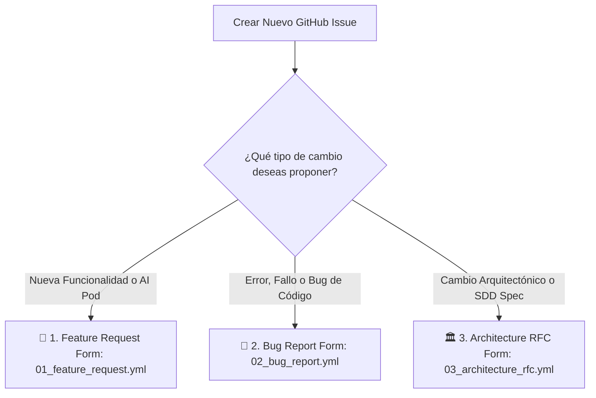

# 📖 Guía Oficial de Creación y Gobernanza de GitHub Issues

**Organización:** AI Pods Enterprise SaaS Platform  
**Repositorio Central de Documentación:** [`onlyone-ai-pods/aipods-docs`](https://github.com/onlyone-ai-pods/aipods-docs)  
**Versión:** `v81.0.0` (Conforme a ISO 9001:2015 & CMMI Level 4)  

---

## 🏛️ 1. Filosofía de Gobernanza de Issues (Paso 0 del Ciclo SDD)

En el modelo **Spec-Driven Development (SDD)** de AI Pods Enterprise SaaS, la creación de un **GitHub Issue es el Paso 0 obligatorio e innegociable** para cualquier requerimiento, refactorización, corrección de bug o cambio de arquitectura.

---

## 🎯 2. Formularios Dinámicos de Issues (GitHub Issue Forms YAML)

Al hacer clic en **"New Issue"** en el repositorio, la plataforma presenta **Formularios Dinámicos e Interactivos (YAML Issue Forms)** que garantizan la calidad de la información:



---

## 🏷️ 3. Convención de Títulos y Etiquetas (Labels)

### Formato del Título del Issue:
```text
[TIPO] <Nombre descriptivo corto en formato Title Case / Kebab>
```

* **`[FEAT]`**: Solicitud de nueva característica, especificación SDD o nuevo AI Pod.
* **`[BUG]`**: Reporte de fallo o ruptura de contrato de API.
* **`[ARCH]`**: Propuesta de cambio estructural de arquitectura o RFC.

### Matriz de Etiquetas Oficiales:

| Etiqueta (Label) | Color Hex | Propósito & Uso |
| :--- | :--- | :--- |
| `feature` | `#a2eeef` | Solicitud de nueva funcionalidad. |
| `bug` | `#d73a4a` | Reporte de error o falla de código. |
| `architecture` | `#0075ca` | Propuesta de cambio de arquitectura o RFC. |
| `needs-spec` | `#d4c5f9` | Requerimiento aprobado que necesita su Spec SDD. |
| `spec-approved` | `#0e8a16` | Especificación integrada en `specs/`. |
| `pod-core` | `#1d76db` | Afecta el motor backend Go Core Engine. |
| `pod-essential` | `#b60205` | AI Pod esencial para cobro, seguridad o fiscalidad SaaS. |
| `frontend-customer` | `#0052cc` | Afecta el Portal de Clientes React 18. |
| `frontend-admin` | `#5319e7` | Afecta el Admin Review Hub React 18. |

---

## 📋 4. Estructura Obligatoria de Criterios de Aceptación (Gherkin BDD)

Todo Issue DEBE incluir criterios de aceptación redactados en formato **Gherkin BDD**:

```gherkin
Feature: Nombre de la Funcionalidad

  Scenario: Comportamiento Esperado Exitoso
    Given [contexto inicial del sistema o usuario autenticado]
    When [acción ejecutada por el usuario o cliente API]
    Then [resultado esperado, contrato JSON o código de respuesta HTTP]
```
