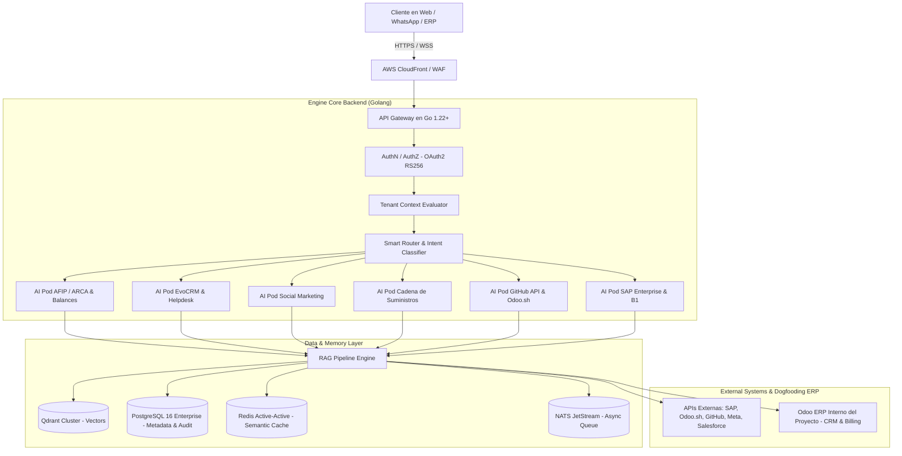

# 📐 Documento de Diseño de Software (SDD) - AI Pods Enterprise SaaS Platform

**Proyecto:** AI Pods Enterprise SaaS Platform (Plataforma Universal de "Servicio como Software")  
**Organización GitHub:** `https://github.com/onlyone-ai-pods`  
**Autor:** Martin Llanos  
**Fecha:** Julio 2026  
**Versión:** `5.3.0`  
**Licencia:** Propietaria del Autor  

---

## 1. Introducción y Propuesta de Valor ("Servicio como Software")

El objetivo de **AI Pods Enterprise** es transformar el modelo tradicional de Software como Servicio (SaaS) mediante el paradigma de **"Servicio como Software" (Service-as-Software)**:

* **SaaS Tradicional:** *"Te alquilo la herramienta para que tú hagas el trabajo"*. (El cliente pone el software y la mano de obra).
* **Servicio como Software (AI Pods Enterprise):** *"Te entrego el trabajo ya hecho, porque nuestro software actúa como la fuerza laboral experta"*. (El conocimiento táctico de consultores Senior en AFIP/ARCA, Odoo, SAP, Salesforce, SCM y DevOps queda "clonado" e institucionalizado en agentes inteligentes autónomos).

El motor backend en Go es **100% universal y agnóstico**. Todas las reglas de negocio, conectores de APIs y limitaciones de dominio residen exclusivamente **dentro de cada AI Pod**.

---

## 2. Arquitectura Ecosistema Multi-Repositorio (`onlyone-ai-pods`)

El sistema está estructurado modularmente en 4 repositorios independientes en la Organización de GitHub **`onlyone-ai-pods`**:

```text
github.com/onlyone-ai-pods/
├── aipods-docs/              [DOCS] 24 Especificaciones SDD, Backlog, SDD.md, OpenAPI, Spec Writer Skill
├── aipods-core-engine/       [BACKEND] Go 1.22+ Server, Smart Router, Multi-Tenant Context, DBs, Docker, Evals
├── aipods-frontend-customer/ [FRONTEND] React 18 / Vite Portal Público & Sandbox ("Servicio como Software")
└── aipods-frontend-admin/    [ADMIN] React 18 / Vite Portal Interno, Senior Review Hub, mTLS & FinOps
```

---

## 3. Arquitectura Tecnológica de Alto Nivel



---

## 4. Catálogo Oficial de AI Pods por Defecto

1. **Pod AFIP / ARCA & Balances Financieros:** Asistencia técnica burocrática, simulación de claves/CSR con OpenSSL y análisis asíncrono de balances en PDF.
2. **Pod EvoCRM & Helpdesk:** Soporte omnicanal conectado a WhatsApp Business y tickets de soporte ERP.
3. **Pod Social Marketing:** Diagnóstico y troubleshooting de APIs de Meta, Instagram Graph API y campañas.
4. **Pod Cadena de Suministros (SCM, WMS, MRP):** Reglas de reabastecimiento, costeo logístico y rutas Push/Pull.
5. **Pod GitHub API & Odoo.sh DevOps Integrator:** Creación automática de repositorios en GitHub del cliente, gestión de PRs y vinculación de despliegues en la PaaS Odoo.sh.
6. **Pod SAP Enterprise (S/4HANA/ECC) & Business One:** Conexión vía SAP Gateway (OData RESTful), SOAP Web Services (WSDL), PyRFC (BAPIs) y B1 Service Layer.

---

## 5. Protocolo de Autoconsumo (Dogfooding CRM & Billing)

La plataforma opera su propio negocio SaaS consumiendo sus propios AI Pods vía eventos en NATS JetStream:

* **Evento `CLIENT_REGISTERED`:** El **Pod Odoo CRM** procesa el registro y crea automáticamente la oportunidad en el modelo `crm.lead` del Odoo ERP interno.
* **Evento `TRIAL_EXPIRED`:** El **Pod Odoo Invoicing** calcula los tokens consumidos (FinOps), emite la factura electrónica (`account.move`) y envía el link de cobro por WhatsApp (EvoCRM) y Email (Amazon SES).
* **Evento `PAYMENT_SUCCESS`:** El **Pod Platform Provisioner** actualiza la cuota del tenant a `PROD_ACTIVE` en $<1,000\text{ms}$.

---

## 6. Onboarding Cero Fricción & Provisionamiento Auto-Servicio

* **Frictionless Signup:** Registro en 1 clic con Google Workspace / Microsoft 365 o Passwordless Magic Link. Sin tarjeta de crédito.
* **Wizard Configuración Empresa (3 Pasos):**
  1. Perfil de empresa y jurisdicción fiscal (pre-carga automática de AFIP/ARCA).
  2. Selección de AI Pods iniciales y migración de documentos probados en el Sandbox.
  3. Vincular conectores de APIs/ERPs (Odoo, SAP, EvoCRM).
* **Aprovisionamiento Zero-Touch (<2,000ms):** Asignación de `tenant_id` UUIDv4, particionado en PostgreSQL 16 y Qdrant, e inicio del tour interactivo del *AHA Moment* ($<60\text{s}$).

---

## 7. Principios Invariantes & Gobernanza

1. **Aislamiento Multi-Tenant Absoluto:** Cláusula invariante `WHERE (tenant_id == CurrentTenantID OR tenant_id == 'GLOBAL') AND status == 'ACTIVE'`.
2. **Protocolo Obligatorio Dry-Run (`dry_run = true`):** Simulación de acciones con efectos secundarios y token de aprobación humana (*Human-in-the-Loop*).
3. **Resiliencia & DRP:** RPO $< 1$ minuto, RTO $< 15$ minutos con Redis Active-Active CRDTs y colas NATS JetStream.
4. **Cumplimiento Normativo:** Marcos ISO 9001 (Calidad), SOC 2 Type II (Seguridad/Privacidad) e ISO 27001.
5. **Gobernanza Git & BDD:** Convención de ramas `<tipo>/<id>-<descripcion>`, Spec PR Gate en `aipods-docs` antes de Code PRs en `aipods-core-engine`, y pruebas automatizadas BDD ejecutadas con `godog` en Go.
