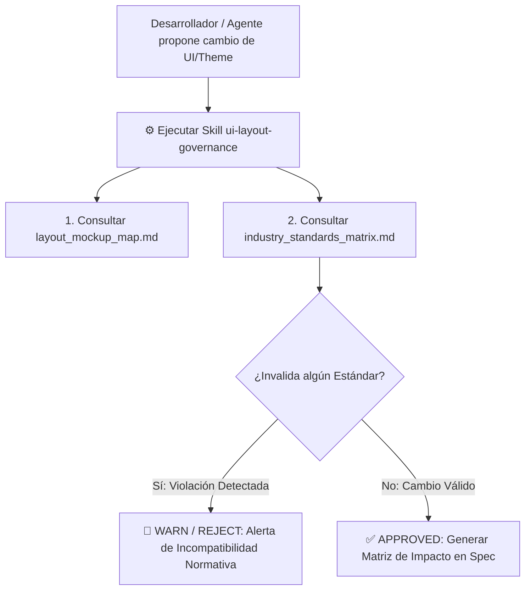

# 📜 SPEC: UI/UX Layout Governance Skill & Mapa Canónico de Nomenclatura
**ID:** SPEC-CORE-41  
**Épica Relacionada:** UI/UX Governance, Skill Kit Extension & Layout Impact Evaluation Protocol (LIEP)  
**Issue Relacionado:** `#22` ([`[FEAT] Governance Skill: ui-layout-governance & Canonical Layout Mockup Map`](https://github.com/onlyone-ai-pods/aipods-docs/issues/22))  
**Estado:** APPROVED / SPEC-DRIVEN  

---

## 1. Visión y Objetivos

Esta especificación establece la Skill de gobernanza **`ui-layout-governance`** para la plataforma **AI Pods Enterprise SaaS**.

Su objetivo es institucionalizar la evaluación del impacto visual y normativo antes de aplicar cualquier mutación a los esquemas de color, layout, espaciado o navegación en el Admin Hub y Customer Portal.

Permite:
1. **Evitar Regresiones Visuales & Normativas**: Alertas tempranas si un cambio destruye controles de **ISO 9241-210 (Ergonomía)**, **WCAG 2.1 AAA (Accesibilidad)**, **SOC 2 Type II** e **ISO 27001**.
2. **Estandarizar la Nomenclatura del Layout (Canonical Mockup Map)**: Mapa de nomenclatura formal para desarrolladores, arquitectos y auditores.
3. **Protocolo LIEP (Layout Impact Evaluation Protocol)**: Matriz de evaluación obligatoria en cada commit o Pull Request que altere la interfaz.

---

## 2. Diagrama del Protocolo LIEP (Layout Impact Evaluation Protocol)



---

## 3. Matriz de Alertas de Estándares Internacionales

| Estándar | Regla de Control Visual | Criterio de Rechazo (REJECT) |
|---|---|---|
| **ISO 9241-210 (Ergonomía)** | Prevención de fatiga en turnos de 6-8h y blancos táctiles $\ge 44\text{px}$. | Rechazar si la superficie de toque es $<44\text{px}$ o si se fuerza scroll vertical masivo. |
| **WCAG 2.1 AAA (Accesibilidad)** | Contraste de texto mínimo 7:1 en temas oscuros y claros. | Rechazar si la relación de contraste cae por debajo de 7:1. |
| **SOC 2 Type II & ISO 27001** | Sin puntos ciegos ni ocultamiento de alertas de severidad. | Rechazar si se eliminan Badges de Alerta de Severidad o notificaciones flotantes. |
| **Full-Width Fluid 100%** | Aprovechamiento del 100% del ancho útil en monitores de 27"/4K. | Rechazar si se vuelve a encajonar la vista a `max-width` fijosa < 1400px en monitores grandes. |

---

## 4. Matriz de Evaluación de Impacto de Layout (Protocolo LIEP)

| Código Elemento | Componente del Layout | Estándar Evaluado | Estado / Resultado | Justificación Técnica & Salvaguarda |
|:---:|---|---|:---:|---|
| `[C1]` | `SUB_SIDEBAR_CONTAINER` | **ISO 9241-210** | ✅ `COMPLIANT` | Superficie útil táctil mantenida a $\ge 44\text{px}$. |
| `[B1]` | `MAIN_TAB_NAVIGATION_BAR` | **SOC 2 Type II** | ✅ `COMPLIANT` | Preservación de badges de alerta de severidad (🔴 Crítico). |
| `[D1]` | `MAIN_CONTENT_PANEL` | **Full-Width 27"** | ✅ `COMPLIANT` | Ancho fluido al 100% sin encajonado en monitores grandes. |
| `[A1]` | `BRAND_HEADER_CONTAINER` | **WCAG 2.1 AAA** | ✅ `COMPLIANT` | Relación de contraste de color $\ge 7:1$ en tema oscuro. |

---

## 5. Escenarios BDD

```gherkin
Feature: Skill ui-layout-governance & Validación de Impacto de Layout

  Scenario: Propuesta de Cambio que Invalida ISO 9241 o Full-Width 27"
    Given un desarrollador o agente intentando modificar `index.css`
    When el cambio intenta reinstaurar un `max-width: 1200px` o reducir botones a 30px
    Then la Skill `ui-layout-governance` genera una Alerta de Rechazo (REJECT)
    And cita la violación explícita a los estándares ISO 9241-210 y SPEC-CORE-40

  Scenario: Aprobación de Mutación de Layout con Matriz de Impacto
    Given una propuesta válida de reorganización visual
    When se ejecuta la Skill `ui-layout-governance`
    Then genera el reporte de impacto normativo y actualiza el mapa canónico `layout_mockup_map.md`
```
