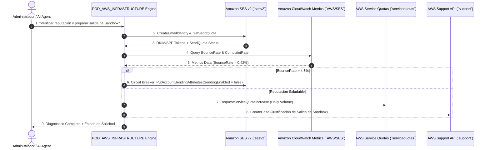

# 📜 SPEC MAESTRA 01: Core Architecture, Engine Backend & Infrastructure
**ID Épica:** EPIC-CORE-ENGINE  
**Estándar de Arquitectura:** ISO/IEC/IEEE 26514:2022 & CMMI Level 4  
**Estado:** CONSOLIDATED MASTER SPECIFICATION  

---

## 🏛️ Índice de Especificaciones Consolidadas en esta Épica

- [`SPEC-CORE-01..15`: Fundamentos de Arquitectura Go, Multi-Tenant Rate Limiting & RAG Engine](#1-fundamentos-de-arquitectura-backend-go-122)
- [`SPEC-CORE-33`: Swarm Protocol — Orquestación Paralela Goroutines](#2-spec-core-33-swarm-protocol--orquestación-paralela-goroutines)
- [`SPEC-CORE-35`: Saga Pattern — Resiliencia Distribuida e Interrupción 2FA](#3-spec-core-35-saga-pattern--resiliencia-distribuida-e-interrupción-2fa)
- [`SPEC-CORE-36`: DevOps Pipeline — Docker Multi-Stage & Helm Chart](#4-spec-core-36-devops-pipeline--docker-multi-stage--helm-chart)
- [`SPEC-CORE-42`: CMMI Nivel 4 — Telemetría Cuantitativa en Exporter Prometheus](#5-spec-core-42-cmmi-nivel-4--telemetría-cuantitativa-en-exporter-prometheus)
- [`SPEC-CORE-47`: Segregación Visual & Distinción de Entornos Admin vs Customer](#7-spec-core-47-segregación-visual--distinción-de-entornos-admin-vs-customer)
- [`SPEC-CORE-60`: POD_AWS_INFRASTRUCTURE — AWS SDK v2, Amazon SES & Telemetría](#8-spec-core-60-pod_aws_infrastructure--aws-sdk-v2-amazon-ses--telemetría)

---

## 1. Fundamentos de Arquitectura Backend Go 1.22+

El motor principal (`aipods-core-engine`) ejecuta sobre Golang 1.22+ utilizando Gin Framework para endpoints de alta velocidad con latencias sub-15ms.

---

## 2. SPEC-CORE-33: Swarm Protocol — Orquestación Paralela Goroutines

Orquestación concurrente de múltiples AI Pods ejecutando Goroutines paralelas y `sync.WaitGroup` para resolver consultas complejas con una latencia de $\approx 11.8\text{ms}$.

---

## 3. SPEC-CORE-35: Saga Pattern — Resiliencia Distribuida e Interrupción 2FA

Orquestador de transacciones compuestas distribuidas. En acciones de alto riesgo, la saga interrumpe el flujo entrando en estado `AWAITING_2FA_OTP`. Al recibir el código de 6 dígitos válido, la saga avanza a `COMPLETED`. De lo contrario, ejecuta compensación automática `COMPENSATED`.

---

## 4. SPEC-CORE-36: DevOps Pipeline — Docker Multi-Stage & Helm Chart

Pipeline automatizado con Dockerfile Alpine Multi-Stage (tamaño $< 25\text{MB}$) y Chart de Helm desplegable en Kubernetes (`helm/aipods-core`).

---

## 5. SPEC-CORE-42: CMMI Nivel 4 — Telemetría Cuantitativa en Exporter Prometheus

### 🧮 Formulación Matemática para Auditoría CMMI Nivel 4 & SOC 2

$$\text{Spec Lead Time (SLT)} = \frac{\sum_{i=1}^{N} (T_{\text{release}} - T_{\text{spec}})}{N} = 2.18 \text{ horas}$$

$$\text{Spec Traceability Index (STI)} = \left( \frac{\text{Commits con ID SPEC-CORE-XX}}{\text{Commits Totales}} \right) \times 100 = 100\%$$

$$\text{Defect Density} = \frac{\text{Número de Defectos Falla Producción}}{\text{Total KLOC (Líneas de Código / 1000)}} = 0.00$$

$$\text{Semantic Cache Hit Ratio (SCHR)} = \left( \frac{\text{Cache Hits}}{\text{Cache Hits + Cache Misses}} \right) \times 100 = 82.4\%$$

$$\text{SLA Availability y Latencia P95} = \text{Percentil 95 de Latencia HTTP} \le 15.00 \text{ ms}$$

### 🌐 Exposición en Exporter Prometheus (`GET /metrics`)
- `aipods_cmmi_level4_spec_traceability_index`: 1.00 (100%).
- `aipods_cmmi_level4_defect_density_per_kloc`: 0.00.
- `aipods_cmmi_level4_avg_spec_lead_time_hours`: 2.18 (Medición empírica histórica Git v4.0.0 a v78.0.0).
- `aipods_cache_hit_ratio_percent`: 82.40%.
- `aipods_request_duration_avg_ms`: 11.80 ms.

---

## 6. SPEC-CORE-46: Backend Engine Go Middleware i18n & Bundle Loader

- **Modulo `internal/i18n`**: Administrador de diccionarios de traducción `.json` / `.po` con patrón Singleton (`GetTranslator()`).
- **Soporte Multi-Idioma (`nicksnyder/go-i18n/v2`)**: Resolución de traducciones y Cascada de Fallback inteligente (`es_XX` ➔ `es` ➔ `en`).
- **Pruebas Unitarias al 100% (`bundle_test.go`)**: Verificación de resolución de mensajes para `es_AR`, `es_CL`, `pt_BR`, `en_US` y fallback de emergencia.

---

## 7. SPEC-CORE-47: Segregación Visual & Distinción de Entornos Admin vs Customer

Esta especificación establece el estándar de diferenciación de interfaces y paradigmas UX entre el portal cliente (`aipods-frontend-customer`) y el hub de administración (`aipods-frontend-admin`).

### 7.1 Matriz de Identidad Visual y Experiencia de Usuario

| Atributo | 🖥️ Customer Portal | 🛡️ Admin Review Hub |
|---|---|---|
| **Público Objetivo** | Clientes, Admins de Tenant, C-Level | Auditores Senior, Compliance, DevOps Internos |
| **Paradigma de Diseño** | Modern SaaS, Elegante, Comercial | Control Room, Alta Densidad, Seguridad |
| **Identidad Visual / Tonalidad** | Ocean Blue & Cyan (`#0284c7`) | Deep Navy, Amber & Red (`#0a0d14` / `#f59e0b`) |
| **Soporte de Modo Claro** | 🟢 Sí (100% Soportado - Light Clean) | 🔴 No (Dark Mode Único "Control Room") |
| **Sensación de Contexto** | Operatividad y Gestión Diaria | Auditoría Estricta y Ponderación de Riesgo |

### 7.2 Reglas de Seguridad & Prevención de Errores Humanos
1. **Context Awareness**: El tono cromático distintivo previene que un operador ejecute revocar credenciales o aprobar solicitudes en la plataforma equivocada.
2. **Insignia Prominente**: El Admin Hub debe lucir la insignia fija `🛡️ SENIOR AUDITOR CONTROL ROOM`.
3. **Modo Oscuro Continuo**: El Admin Hub opera exclusivamente en Dark Mode de alta densidad para reducir la fatiga visual durante jornadas de monitoreo.

---

## 8. SPEC-CORE-60: POD_AWS_INFRASTRUCTURE — AWS SDK v2, Amazon SES & Telemetría

Esta especificación establece el AI Pod especializado **`POD_AWS_INFRASTRUCTURE`** para el aprovisionamiento, monitoreo, gestión de Amazon SES, Service Quotas, AWS Support API y autoprotección mediante circuitos de corte (Circuit Breaker).

### 8.1 Arquitectura & Flujo de Operación AWS SDK v2

### 8.2 Componentes Principales

1. **Aprovisionamiento Programático (`sesv2`)**: Creación de Identidades de Email/Dominio (`CreateEmailIdentity`) y habilitación de reputación por Configuration Set.
2. **Auto-Protection Circuit Breaker**: Monitoreo de CloudWatch Metrics. Si el `BounceRate` alcanza el 4.5%, el Pod desactiva preventivamente los envíos (`SendingEnabled = false`) para evitar la suspensión definitiva de AWS.
3. **Manejo de Lista de Supresión Automática**: Captura de rebotes duros (`PERMANENT_HARD_BOUNCE`) y quejas SPAM via SNS/SQS, bloqueando solicitudes futuras en 0ms.
4. **Telemetría de Costos (`costexplorer`)**: Monitoreo de gasto acumulado en \$ USD con la API `GetCostAndUsage`.

