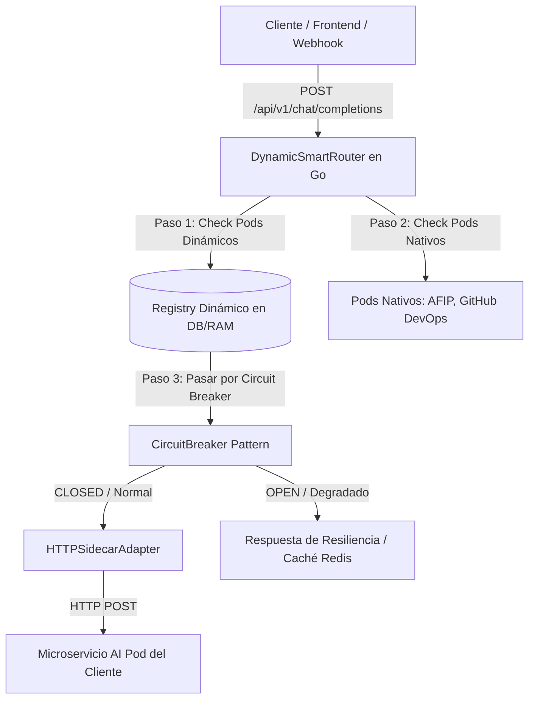

# 📄 Especificación SDD: Smart Router Dinámico & Resiliencia (Circuit Breaker)

**Especificación ID:** `01_smart_router_spec`  
**Dominio:** Arquitectura Core Backend  
**Versión:** `7.0.0`  
**Estado:** IMPLEMENTADO & AUDITADO  

---

## 1. Visión General del Enrutador Dinámico (Dynamic Plugin-as-a-Service)

El **Smart Router Dinámico (`DynamicSmartRouter`)** es el componente central en Go 1.22+ encargado de recibir las consultas de los clientes y dirigirlas al **AI Pod** adecuado en tiempo sub-milisegundo.

Para evitar la recompilación del motor backend al crear nuevos AI Pods, el sistema soporta **Registro Dinámico en Tiempo de Ejecución (Runtime Pod Registration)** a través del endpoint HTTP `POST /api/v1/pods/register` y el adaptador genérico `HTTPSidecarAdapter`.

---

## 2. Diagrama de Arquitectura de Enrutamiento y Resiliencia



---

## 3. Registro Dinámico sin Recompilación (`POST /api/v1/pods/register`)

Cualquier nuevo AI Pod creado por un cliente se registra dinámicamente mediante el contrato JSON:

```json
{
  "pod_id": "POD_CUSTOM_LOGISTICS_SERVICE",
  "name": "AI Pod Logística y Despachos Personalizado",
  "tenant_id": "tenant_logistics_corp",
  "endpoint_url": "http://pod-logistics-service:8089/process",
  "keywords": ["despacho", "seguimiento", "camion"],
  "status": "ACTIVE"
}
```

---

## 4. Mecanismo Resiliente: Cortacircuitos (Circuit Breaker)

Para prevenir fallos en cascada cuando el microservicio de un AI Pod dinámico falla o no responde:

1. **Estado `CLOSED` (Normal):** Todas las peticiones fluyen hacia el microservicio del Pod.
2. **Estado `OPEN` (Tripped):** Si se acumulan 2 fallos consecutivos o timeouts ($>5\text{s}$), el cortacircuitos se abre por 10 segundos, rechazando peticiones directas y activando la **Respuesta de Degradación Grácil (Graceful Fallback)**.
3. **Estado `HALF_OPEN` (Recuperación):** Al expirar el tiempo de espera, se permite 1 petición de prueba para verificar si el microservicio se ha recuperado.

---

## 5. Criterios de Aceptación BDD (`Godog`)

```gherkin
Característica: Registro Dinámico de AI Pods y Cortacircuitos de Resiliencia

  Escenario: Registrar un AI Pod dinámico sin recompilar el Core Engine
    Dado que el servidor Go está en ejecución en puerto 8080
    Cuando se envía una petición POST a "/api/v1/pods/register" con el Pod "POD_CUSTOM_LOGISTICS"
    Entonces el estado de la respuesta debe ser 200 OK
    Y el Smart Router debe enrutar consultas de "despacho" hacia el nuevo Pod dinámico inmediatamente

  Escenario: Activación del Cortacircuitos ante fallo de un microservicio externo
    Dado que el AI Pod "POD_CUSTOM_LOGISTICS" presenta fallos consecutivos de red
    Cuando el cortacircuitos detecta 2 fallos continuos
    Entonces el estado cambia a "OPEN"
    Y las siguientes consultas devuelven una respuesta de resiliencia grácil sin romper el servidor
```
