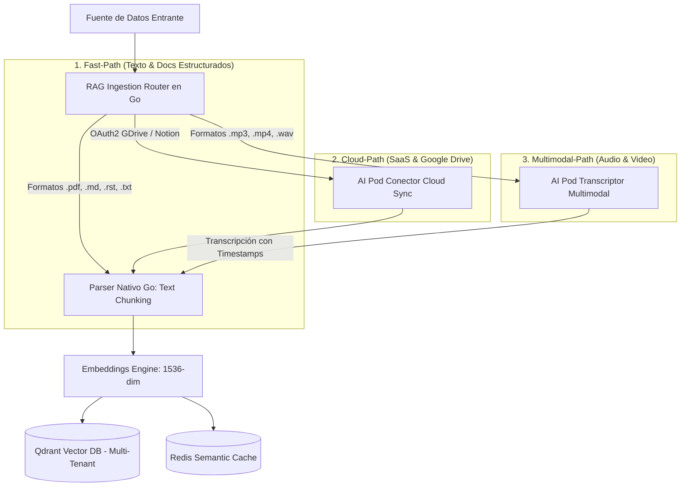

# 📄 Especificación SDD: Ingesta RAG Multimodal & Multi-Fuente (Multimodal Ingestion Pipeline)

**Especificación ID:** `05_multimodal_and_multisource_rag_ingestion_spec`  
**Dominio:** Arquitectura Core Backend & AI Pods  
**Versión:** `8.2.0`  
**Estado:** PROPUESTO & DOCUMENTADO  

---

## 1. Visión General del Pipeline de Ingesta Multimodal

Para garantizar que la plataforma **AI Pods Enterprise** pueda institucionalizar el conocimiento de cualquier empresa, el motor RAG debe aceptar y procesar 3 categorías de fuentes de datos sin estar limitado a archivos PDF:

1. **Documentos de Texto y Código:** `.pdf`, `.md`, `.rst`, `.txt`, `.json`, `.yaml`, `.csv`.
2. **Fuentes Cloud & Integraciones SaaS:** Google Drive (GDocs), Notion, Confluence, SharePoint, Slack.
3. **Multimedia & Audio/Video:** Audios de soporte (`.mp3`, `.wav`, `.m4a`), videos cortos de capacitación (`.mp4`), notas de voz de WhatsApp Business.

---

## 2. Arquitectura de Ingesta Híbrida (Ingestion Gateway + Specialized AI Pods)



---

## 3. Matriz de Estrategias de Procesamiento por Tipo de Fuente

| Tipo de Fuente / Archivo | Método de Extracción | Responsable de Procesamiento | Metadatos Extraídos |
| :--- | :--- | :--- | :--- |
| **PDF (`.pdf`)** | Extraer texto estructurado y tablas. | Engine Core (Go Native Parser) | `file_name`, `page_number`, `tenant_id` |
| **Markdown (`.md`) / reST (`.rst`)** | Parsear AST de encabezados (`#`, `==`). | Engine Core (Go Native Parser) | `heading_section`, `doc_type`, `tenant_id` |
| **Google Drive (GDocs/Sheets)** | Polling/Webhook OAuth2 API. | **Pod Conector Cloud Workspace** | `gdrive_file_id`, `last_modified`, `author` |
| **Audio (`.mp3`, `.wav`, WhatsApp)** | Transcripción STT (Whisper / Gemini). | **Pod Transcriptor Multimodal** | `audio_duration`, `timestamp_start`, `speaker` |
| **Video (`.mp4`, Capacitaciones)** | Extracción de pista de audio + OCR de frames. | **Pod Transcriptor Multimodal** | `frame_timestamp`, `video_title` |

---

## 4. Protocolo de Transcripción Multimodal Asíncrona (NATS JetStream)

Para archivos de audio/video pesados que pueden demorar segundos o minutos en procesarse:

1. El cliente sube el archivo de audio/video vía `POST /api/v1/ingest/multimodal`.
2. El API Server emite el evento `INGEST_MULTIMEDIA_SUBMITTED` a la cola asíncrona **NATS JetStream**.
3. El **Pod Transcriptor Multimodal** consume el evento, convierte el audio a texto limpio con sellos de tiempo (*timestamps*) y emite `INGEST_MULTIMEDIA_COMPLETED`.
4. El motor RAG indexa los fragmentos transcritos en **Qdrant Vector DB** etiquetados con el `tenant_id`.

---

## 5. Criterios de Aceptación BDD (`Godog`)

```gherkin
Característica: Ingesta RAG Multimodal y Multi-Fuente

  Escenario: Ingestar documento de texto estructurado Markdown (.md)
    Dado que el usuario sube el archivo "politica_soporte.md" para el tenant "tenant_acme"
    Cuando el RAG Ingestion Router procesa el archivo
    Entonces el texto se divide en chunks respetando las secciones del documento
    Y los vectores resultantes quedan aislados con "tenant_acme" en Qdrant

  Escenario: Ingestar nota de voz de audio (.mp3) mediante AI Pod Multimodal
    Dado que se envía un archivo de audio "llamada_cliente.mp3"
    Cuando el Pod Transcriptor Multimodal procesa el audio
    Entonces se genera una transcripción de texto con sellos de tiempo
    Y la transcripción queda indexada en el motor RAG para búsquedas de similitud
```
