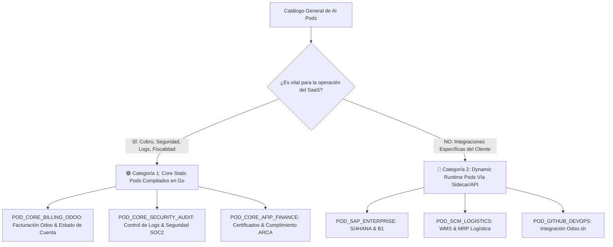

# 📄 Especificación SDD: AI Pods Esenciales (Core Compilados) vs. AI Pods de Dominio (Dinámicos)

**Especificación ID:** `06_essential_core_pods_vs_dynamic_domain_pods_spec`  
**Dominio:** Estrategia de Negocio & Arquitectura Core  
**Versión:** `11.0.0`  
**Estado:** PROPUESTO & CLASIFICADO  

---

## 1. Criterio Estratégico de Clasificación de AI Pods

Para optimizar el rendimiento, tamaño del ejecutable y mantenibilidad de la plataforma **AI Pods Enterprise**, se establece una regla clara de segregación entre lo que pertenece al **Núcleo Operativo SaaS (Compilado en Go)** y lo que pertenece al **Dominio Específico del Cliente (Carga Dinámica en Caliente)**.

### Regla de Inclusión en el Core Engine:
> *"Un AI Pod DEBE ser compilado estáticamente dentro del Core Engine ÚNICAMENTE si su ausencia compromete la facturación, la seguridad, la observabilidad de logs o la validez legal fiscal de la propia plataforma SaaS."*

---

## 2. Matriz de Clasificación Definitiva

---

## 3. Descripción de AI Pods por Categoría

### 🟢 Categoría 1: AI Pods Esenciales del Core (Compilados en Go)

1. **`POD_CORE_BILLING_ODOO` (Facturación & Cobranza Odoo):**
   - **Propósito:** Emisión automática de facturas electrónicas (`account.move`), reporte de estados de cuenta de clientes y validación de cobros del SaaS.
   - **Justificación de Negocio:** Esencial. Sin este Pod, la plataforma no puede cobrar ni gestionar la suscripción de sus usuarios.

2. **`POD_CORE_SECURITY_AUDIT` (Seguridad, Logs & Auditoría Inmutable):**
   - **Propósito:** Inspección continua de logs de acceso, prevención de ataques de inyección RAG, auditoría de cuotas de tokens por tenant y cumplimiento SOC 2 / ISO 27001.
   - **Justificación de Negocio:** Esencial. Protege la infraestructura contra intrusiones, fuga de datos y sobrecostos por uso malicioso.

3. **`POD_CORE_AFIP_FINANCE` (Certificación & Cumplimiento Fiscal ARCA):**
   - **Propósito:** Generación de CSR OpenSSL, firma digital y cumplimiento legal tributario.
   - **Justificación de Negocio:** Esencial. Otorga validez fiscal a la facturación emitida.

---

### 🔵 Categoría 2: AI Pods de Dominio del Cliente (Registrados Dinámicamente)

1. **`POD_SAP_ENTERPRISE` (SAP S/4HANA / ECC & Business One):**
   - **Clasificación:** Dinámico / Opcional.
   - **Justificación de Negocio:** Integración corporativa específica para grandes empresas. Debe ser registrado dinámicamente por los clientes que lo requieran vía `POST /api/v1/pods/register`.

2. **`POD_SCM_LOGISTICS` (Cadena de Suministros WMS / MRP):**
   - **Clasificación:** Dinámico / Opcional.
   - **Justificación de Negocio:** Módulo sectorial para empresas industriales/logísticas. No afecta la operación del SaaS.

3. **`POD_GITHUB_DEVOPS` (DevOps Odoo.sh & Repositorios GitHub):**
   - **Clasificación:** Dinámico / Opcional.
   - **Justificación de Negocio:** Herramienta especializada para equipos de desarrollo.

---

## 4. Próximos Pasos para Validación & Refactorización Futura

1. **Creación del Pod Esencial `POD_CORE_SECURITY_AUDIT`:** Implementar el Pod dedicado al control de logs, alertas de intrusión y auditoría de seguridad en el backend en Go.
2. **Refactorización de Enrutador:** Ajustar `dynamic_router.go` para mantener únicamente los Pods Esenciales de la Categoría 1 en la tabla estática compilada, delegando todos los demás Pods de la Categoría 2 al registro dinámico en tiempo de ejecución.
