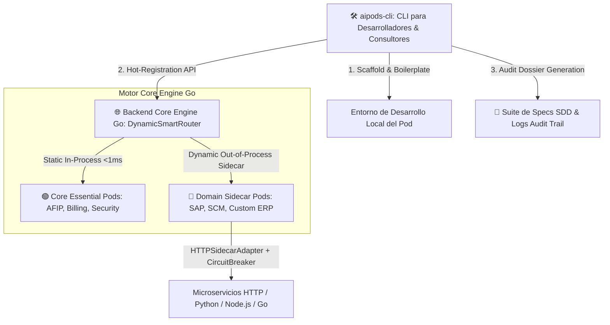

# 📜 SPEC: Arquitectura del Ecosistema AI Pods, Herramienta CLI (`aipods-cli`) y Patrones de Integración

**ID:** SPEC-CORE-28  
**Épica Relacionada:** Arquitectura de Plataforma, Ecosystem Tooling & AI Pod Standards  
**Estado:** PROPOSED / SPEC-DRIVEN  

---

## 1. Visión General del Ecosistema AI Pods

Para garantizar escalabilidad, seguridad multi-tenant y tolerancia a fallos, la plataforma **AI Pods Enterprise SaaS** estructura el ecosistema de AI Pods en **3 modalidades de ejecución** desacopladas:



---

## 2. Modalidades de Ejecución de AI Pods

| Modalidad de AI Pod | Tipo de Ejecución | Latencia | Tolerancia a Fallos | Ejemplos de Pods |
| :--- | :--- | :---: | :--- | :--- |
| **🟢 1. Pods Nativos del Core** | Compilados en el binario Go (*In-Process*) | **$< 1\text{ ms}$** | Directa en memoria | `POD_CORE_BILLING_ODOO`, `POD_CORE_SECURITY_AUDIT`, `POD_AFIP_FINANCE` |
| **🔵 2. Pods Dinámicos Sidecar** | Microservicios externos HTTP (*Out-of-Process*) | **$10 - 30\text{ ms}$** | Protegido por **`CircuitBreaker`** (`CLOSED`, `OPEN`, `HALF_OPEN`) | `POD_SAP_ENTERPRISE`, `POD_SCM_LOGISTICS`, Pods de Clientes |
| **🟡 3. Pods Efímeros Sandbox** | Espacios aislados temporales (*Playground*) | **$< 5\text{ ms}$** | Límite 3 consultas / Expira en 30 min | Sesiones de prueba desde el Customer Portal |

---

## 3. Rol y Arquitectura de `aipods-cli` (Developer & Operator Tooling)

El CLI **`aipods-cli`** es la herramienta oficial de línea de comandos para desarrolladores, operadores y auditores:

### Módulo 1: Desarrollo y Scaffold (`aipods-cli pod ...`)
* **`aipods-cli pod init --name=POD_CUSTOM`**: Genera la estructura de código base estandarizada cumpliendo la interfaz `pod.BaseAIPod`, esquemas JSON de entrada/salida y suite de pruebas BDD `pod_test.go`.
* **`aipods-cli pod test --pod=POD_CUSTOM`**: Ejecuta la validación BDD en entorno local.

### Módulo 2: Registro Operacional en Caliente (`aipods-cli register ...`)
* **`aipods-cli register --id=POD_CUSTOM --endpoint=http://sidecar:9095 --keywords=kw1,kw2`**: Invoca el endpoint `/api/v1/pods/register` registrando el Pod dinámico en el `DynamicSmartRouter` en caliente sin reiniciar el motor Go.

### Módulo 3: Auditoría y Cumplimiento Normativo (`aipods-cli audit ...`)
* **`aipods-cli audit dossier --scope=global`**: Compila el expediente normativo ISO 9001 / SOC 2 Type II firmándolo con OpenSSL SHA-256.
* **`aipods-cli audit verify --dossier=file.pdf`**: Verifica la validez criptográfica del expediente.

---

## 4. Matriz de Patrones de Diseño Cumplidos

1. **Ports & Adapters (Hexagonal Architecture):** Interfaz agnóstica `pod.BaseAIPod` desacoplada del medio de transporte.
2. **Dynamic Sidecar Pattern:** Registro de microservicios dinámicos en tiempo de ejecución.
3. **Circuit Breaker Pattern:** Aislamiento de fallas de microservicios dinámicos (`CLOSED`, `OPEN`, `HALF_OPEN`).
4. **Human-in-the-Loop Pattern:** Protocolo `dry_run = true` devolviendo `ApprovalToken` criptográfico.
5. **Spec-Driven Development (SDD):** Trazabilidad completa respaldada por especificaciones ejecutables `.spec.md`.

---

## 5. Criterios de Aceptación (Gherkin BDD)

```gherkin
Feature: Arquitectura del Ecosistema AI Pods y Herramienta aipods-cli

  Scenario: Inicialización de un Nuevo AI Pod con aipods-cli (Scaffold Path)
    Given un desarrollador ejecutando `aipods-cli pod init --name=POD_TEST_SCRIBER`
    When el comando genera la estructura de carpetas
    Then debe crear la implementación cumpliendo la interfaz `pod.BaseAIPod`
    And incluir el archivo de pruebas BDD `pod_test.go` listo para ejecución

  Scenario: Registro de un Pod Dinámico en Caliente (Hot-Registration Path)
    Given un microservicio sidecar ejecutándose en `http://localhost:9095`
    When el operador ejecuta `aipods-cli register --id=POD_TEST_SCRIBER --endpoint=http://localhost:9095 --keywords=test`
    Then el `DynamicSmartRouter` debe registrar el Pod dinámico en memoria en caliente
    And enrutar las consultas coincidentes al nuevo sidecar sin reiniciar el motor Go

  Scenario: Aislamiento de Fallas con CircuitBreaker ante Caída de Sidecar (Failure Isolation)
    Given un AI Pod dinámico cuyo microservicio HTTP responde con errores HTTP 500 consecutivos
    When el número de fallas supera el umbral configurado (ej: 3 fallas)
    Then el `CircuitBreaker` debe cambiar su estado a `OPEN`
    And retornar un mensaje de fallback amigable sin bloquear las peticiones de otros tenants

  Scenario: Simulación Dry-Run (`dry_run = true`)
    Given una consulta enviada a cualquier AI Pod del ecosistema con `dry_run = true`
    When el Pod procesa la solicitud
    Then debe retornar `IsDryRun: true` y `ActionName: "<nombre_accion>"`
    And generar un `ApprovalToken` inmutable sin aplicar mutaciones persistentes
```
