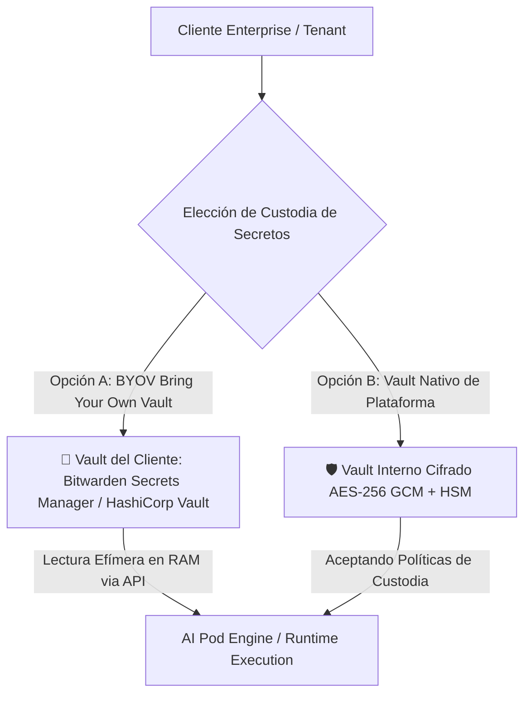

# 📜 SPEC: Modelo Híbrido de Gestión de Secretos del Tenant (BYOV Bitwarden Secrets Manager & Native Vault)

**ID:** SPEC-CORE-29  
**Épica Relacionada:** Seguridad Enterprise, Custodia de Secretos & Cumplimiento SOC 2 / ISO 27001  
**Issue Relacionado:** `#11` ([`[FEAT] Módulo Híbrido de Gestión de Secretos (BYOV Bitwarden Secrets Manager & Native Vault)`](https://github.com/onlyone-ai-pods/aipods-docs/issues/11))  
**Estado:** PROPOSED / SPEC-DRIVEN  

---

## 1. Justificación de Negocio & Seguridad

El manejo de credenciales altamente sensibles (Clave Fiscal de AFIP/ARCA, API Keys de SAP, contraseñas de portales) es una preocupación central para clientes corporativos.

Para maximizar la confianza y cumplir con auditorías ISO 27001 y SOC 2 Type II, la plataforma implementa un **Modelo Híbrido de Custodia de Secretos por Tenant**:



---

## 2. Modalidades de Custodia de Secretos

### Opción A: BYOV (Bring Your Own Vault / Bitwarden Secrets Manager)
- **Mecanismo:** El cliente configura su `service_account_token` de **Bitwarden Secrets Manager** (o HashiCorp Vault / AWS Secrets Manager).
- **Lectura Efímera:** Cuando un AI Pod requiere una credencial para ejecutar una macro o trámite, consulta la API de Bitwarden **exclusivamente en la memoria RAM volátil** y destruye el secreto de la memoria al finalizar la sesión.
- **Invariante:** La contraseña del cliente **NUNCA se persiste en los discos ni en la base de datos de la plataforma**.

### Opción B: Vault Nativo de Plataforma (Platform Native Vault)
- **Mecanismo:** El cliente ingresa credenciales en el Customer Portal aceptando los Términos de Servicio y la Política de Custodia.
- **Cifrado:** Cifrado simétrico **AES-256 GCM** utilizando una clave única por tenant (`tenant_key`) combinada con una clave maestra del sistema.

---

## 3. Criterios de Aceptación (Gherkin BDD)

```gherkin
Feature: Módulo Híbrido de Gestión de Secretos (BYOV Bitwarden & Native Vault)

  Scenario: Lectura Efímera de Secretos desde Bitwarden Secrets Manager (BYOV Path)
    Given un tenant configurado con su Service Account Token de Bitwarden
    When un AI Pod solicita una credencial para ejecutar un trámite
    Then el motor Go debe consultar la API de Bitwarden exclusivamente en memoria RAM volátil
    And destruir la credencial de la memoria al finalizar la ejecución de la sesión

  Scenario: Cifrado en Reposo en Vault Nativo de Plataforma (Native Vault Path)
    Given un cliente ingresando sus credenciales en el Customer Portal
    Then la plataforma debe cifrar el secreto con AES-256 GCM usando la clave única del tenant
    And no permitir el acceso en texto plano a ningún administrador

  Scenario: Revocación Inmediata de Secretos (Security Gate)
    Given un tenant revocando su Service Account Token en Bitwarden
    When un AI Pod intenta ejecutar una consulta posterior
    Then la API de Bitwarden debe retornar 401 Unauthorized
    And el AI Pod debe abortar la ejecución sin exponer datos anteriores

  Scenario: Simulación Dry-Run (`dry_run = true`)
    Given una solicitud enviada con `dry_run = true` solicitando verificación de credenciales
    When el gestor de secretos evalúa la conexión con Bitwarden o Vault Nativo
    Then debe retornar `IsDryRun: true` y `ActionName: "validar_custodia_secretos"`
    And confirmar el estado de conexión sin extraer valores en texto plano
```
