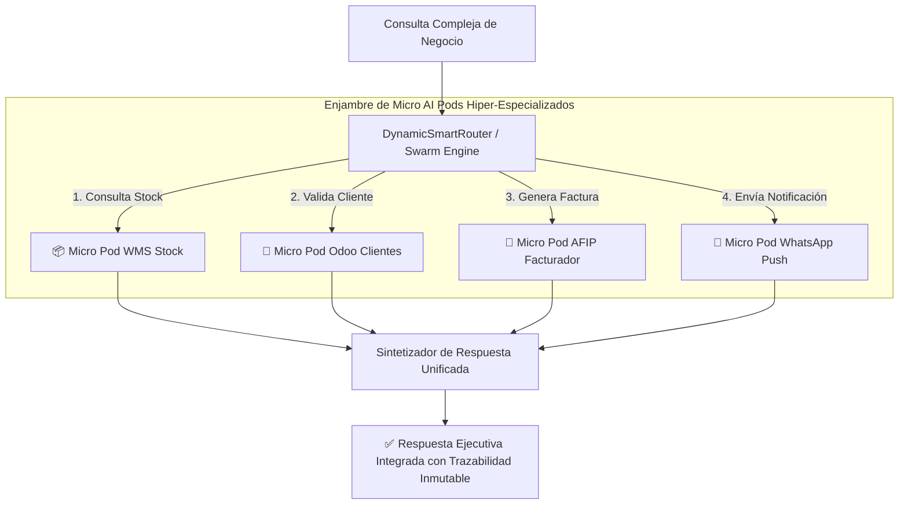

# 📜 SPEC: Motor de Orquestación de Enjambre de Micro AI Pods (Swarm Protocol)

**ID:** SPEC-CORE-30  
**Épica Relacionada:** Arquitectura Micro-Agentes, Dynamic Routing & Swarm Orchestration  
**Issue Relacionado:** `#12` ([`[FEAT] Motor de Orquestación de Enjambre de Micro AI Pods (Swarm Protocol)`](https://github.com/onlyone-ai-pods/aipods-docs/issues/12))  
**Estado:** PROPOSED / SPEC-DRIVEN  

---

## 1. Justificación Arquitectónica

La plataforma adopta el **Principio de Responsabilidad Única (SOLID)** aplicado a agentes de inteligencia artificial: en lugar de construir agentes monolíticos complejos, la arquitectura fomenta **Micro AI Pods hiper-especializados**.



---

## 2. Ventajas del Modelo de Micro AI Pods

1. **Alta Precisión y Cero Alucinación:** RAG acotado y esquemas JSON estrictos por cada micro-dominio.
2. **Reusabilidad Estilo "Bloques de Lego":** Composición modular de flujos combinando Micro AI Pods existentes.
3. **Aislamiento de Fallos y Escalabilidad Independiente:** Cada Micro AI Pod puede escalar o fallar de forma independiente sin afectar el resto del sistema.

---

## 3. Criterios de Aceptación (Gherkin BDD)

```gherkin
Feature: Motor de Orquestación de Enjambre de Micro AI Pods (Swarm Protocol)

  Scenario: Orquestación y Ejecución en Paralelo de Micro AI Pods (Swarm Path)
    Given una consulta ejecutiva que requiere datos de facturación, stock y fiscalidad
    When el DynamicSmartRouter activa el enjambre de Micro AI Pods
    Then debe consultar en paralelo `POD_CORE_BILLING`, `POD_SCM_LOGISTICS` y `POD_AFIP_FINANCE`
    And sintetizar una única respuesta ejecutiva unificada

  Scenario: Tolerancia a Fallos y Degradaición Graciosa (Fallback Path)
    Given un Micro AI Pod del enjambre no disponible o en estado `CircuitBreaker OPEN`
    When el orquestador evalúa la consulta
    Then debe retornar la información parcial de los Pods disponibles
    And indicar de forma explícita el estado degradado del Pod afectado sin colapsar la respuesta

  Scenario: Preservación de Trazabilidad Multi-Pod (Audit Trail)
    Given una respuesta generada por el enjambre de Micro AI Pods
    When se inspecciona la propiedad `citations` y el log de auditoría
    Then debe registrar los IDs de todos los Micro AI Pods participantes
    And mantener la firma de la traza para auditoría compliance

  Scenario: Simulación Dry-Run (`dry_run = true`)
    Given una consulta enviada al enjambre con `dry_run = true`
    When los Micro AI Pods procesan la simulación
    Then cada Pod debe retornar su `DryRunResult` individual con su `ApprovalToken`
    And el orquestador debe consolidar los tokens en un reporte único de simulación
```
