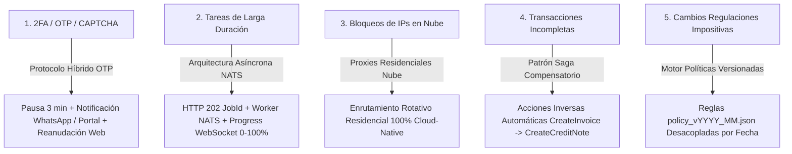

# 📜 SPEC: Motor de Resiliencia Enterprise (OTP Interruption, NATS JobId, Saga Rollbacks & Policy Rulesets)

**ID:** SPEC-CORE-31  
**Épica Relacionada:** Resiliencia de Producción, Manejo de Interrupciones & Saga Fault Tolerance  
**Issue Relacionado:** `#13` ([`[FEAT] Motor de Resiliencia Enterprise (2FA OTP Interruption, NATS JobId, Saga Pattern & Policy Rulesets)`](https://github.com/onlyone-ai-pods/aipods-docs/issues/13))  
**Estado:** PROPOSED / SPEC-DRIVEN  

---

## 1. Justificación Arquitectónica

La ejecución en producción de AI Pods e integraciones complejas enfrenta 5 desafíos críticos de infraestructura y negocio: interrupciones por doble factor 2FA/OTP, tareas masivas de larga duración, bloqueos de IPs de data centers, transacciones multi-paso incompletas y cambios regulatorios impositivos repentinos.

Para solucionar estos escenarios sin degradar la experiencia de usuario ni violar contratos SLA, la plataforma formaliza el **Motor de Resiliencia Enterprise**:



---

## 2. Los 5 Pilares del Motor de Resiliencia

### 1. Protocolo Híbrido OTP en WhatsApp / Portal
- **Mecanismo:** Cuando un Pod detecta una interrupción por 2FA/OTP, congela la sesión web por 3 minutos en estado `WAITING_HUMAN_OTP` y envía una alerta push por EvoCRM WhatsApp y Customer Portal.
- **Reanudación:** El cliente ingresa el código de 6 dígitos en 1 clic y el Pod reanuda el trámite en la misma sesión web.

### 2. Arquitectura Asíncrona NATS con JobId
- **Mecanismo:** Tareas con duración de 2 min a 2 hrs responden inmediatamente HTTP 202 Accepted en $<50\text{ ms}$ con un `JobId`.
- **Monitoreo:** El progreso se transmite en tiempo real (0% al 100%) por WebSocket y notificación final por WhatsApp.

### 3. Pool de Proxies Residenciales 100% Cloud-Native
- **Mecanismo:** Todo el tráfico saliente hacia portales gubernamentales o bancarios se enruta a través de un pool rotativo de proxies residenciales en la nube, evitando bloqueos de IPs de data centers AWS/GCP sin instalar software local.

### 4. Patrón Saga con Compensación Automática
- **Mecanismo:** Todo AI Pod declara su acción inversa (ej: `CreateInvoice` $\rightarrow$ `CreateCreditNote`). Si falla un paso intermedio en una cadena de ejecución, el orquestador revierte automáticamente los pasos anteriores.

### 5. Motor de Políticas Impositivas Versionadas Desacopladas
- **Mecanismo:** Las alícuotas impositivas y retenciones se declaran en archivos `policy_vYYYY_MM.json` desacoplados del código Go/Python, evaluando las reglas según la fecha del comprobante.

---

## 3. Criterios de Aceptación (Gherkin BDD)

```gherkin
Feature: Motor de Resiliencia Enterprise para AI Pods

  Scenario: Interrupción por 2FA/OTP y Reanudación vía WhatsApp (OTP Path)
    Given un AI Pod navegando en un portal fiscal que solicita un código 2FA/OTP
    When el Pod detecta el desafío de autenticación
    Then debe pausar la sesión por 3 minutos en estado WAITING_HUMAN_OTP
    And enviar una alerta push con botón de ingreso de código al WhatsApp del cliente
    And reanudar el trámite exitosamente al recibir el código de 6 dígitos

  Scenario: Delegación Asíncrona de Tareas Largas en NATS (Async Job Path)
    Given un cliente solicitando la emisión masiva de 5,000 facturas
    When la API recibe la petición
    Then debe responder HTTP 202 Accepted en menos de 50ms con un `JobId`
    And delegar la ejecución a los workers NATS transmitiendo el avance 0-100% por WebSocket

  Scenario: Reversión Automática ante Falla Intermedia (Saga Rollback Path)
    Given una cadena de ejecución donde la factura fue emitida pero el cobro posterior falló
    When el orquestador detecta la falla del cobro
    Then debe ejecutar automáticamente la acción de compensación `CreateCreditNote()`
    And generar un reporte inmutable de auditoría del rollback en el log `audit_trail`

  Scenario: Simulación Dry-Run (`dry_run = true`)
    Given una petición enviada al motor de resiliencia con `dry_run = true`
    When el sistema evalúa la cadena Saga y el estado del OTP
    Then debe retornar `IsDryRun: true` y `ActionName: "evaluar_resiliencia_enterprise"`
    And generar un `ApprovalToken` inmutable sin aplicar mutaciones persistentes
```
