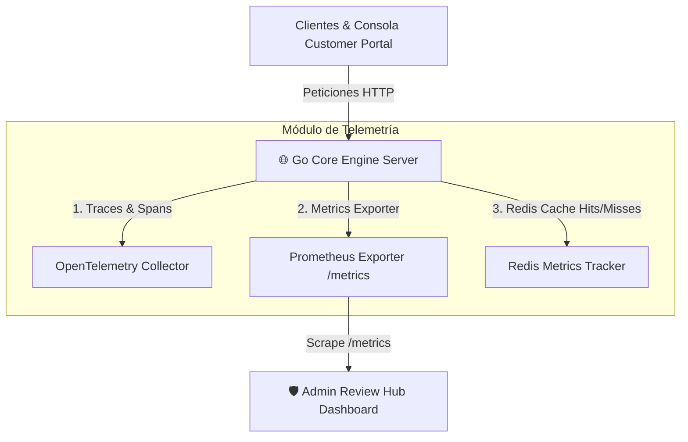

# 📜 SPEC: Dashboard de Telemetría OpenTelemetry, Prometheus & Observabilidad Real-Time
**ID:** SPEC-CORE-25  
**Épica Relacionada:** Telemetría Enterprise, Observabilidad & Monitoring (ISO 27001 / SOC 2)  
**Issue Relacionado:** `#4` ([`[FEAT] Dashboard de Telemetría OpenTelemetry & Prometheus/Grafana`](https://github.com/onlyone-ai-pods/aipods-docs/issues/4))  
**Estado:** APPROVED / SPEC-DRIVEN  

---

## 1. Visión y Objetivos

Esta especificación establece el estándar de **Observabilidad y Telemetría en Tiempo Real** para todo el ecosistema de **Be OnlyOne / AI Pods**.

Permite a los operadores enterprise y administradores del sistema monitorear la salud del servidor Go Core Engine, la latencia de respuesta de los AI Pods, el desempeño del Caché Semántico en Redis y las peticiones bloqueadas por Rate Limiting.

---

## 2. Arquitectura de Observabilidad



---

## 3. Matriz de Métricas Prometeus (`GET /metrics`)

| Nombre de la Métrica | Tipo | Etiquetas (Labels) | Descripción |
|---|---|---|---|
| `aipods_requests_total` | Counter | `pod_id`, `tenant_id`, `status` | Total de peticiones procesadas por los AI Pods |
| `aipods_request_duration_seconds` | Histogram | `pod_id`, `le` (buckets) | Latencia de respuesta (P50, P95, P99) |
| `aipods_cache_hits_total` | Counter | `tenant_id` | Aciertos de respuestas en el Caché Semántico Redis |
| `aipods_cache_misses_total` | Counter | `tenant_id` | Fallos de caché (requiere inferencia) |
| `aipods_rate_limit_exceeded_total` | Counter | `tenant_id` | Total de peticiones bloqueadas con HTTP 429 |
| `aipods_active_sandboxes` | Gauge | — | Sesiones activas en el Sandbox efímero |

---

## 4. Estructura del Endpoint `/metrics` (Prometheus Format)

```text
# HELP aipods_requests_total Total number of processed AI Pod requests.
# TYPE aipods_requests_total counter
aipods_requests_total{pod_id="POD_AFIP_FISCAL",tenant_id="TENANT_DEMO_001",status="200"} 142
aipods_requests_total{pod_id="POD_ODOO_ENTERPRISE",tenant_id="TENANT_DEMO_001",status="200"} 89

# HELP aipods_cache_hits_total Total Redis semantic cache hits.
# TYPE aipods_cache_hits_total counter
aipods_cache_hits_total{tenant_id="TENANT_DEMO_001"} 98

# HELP aipods_cache_misses_total Total Redis semantic cache misses.
# TYPE aipods_cache_misses_total counter
aipods_cache_misses_total{tenant_id="TENANT_DEMO_001"} 44
```

---

## 5. Dashboard Visual en Admin Review Hub (`TelemetryDashboard.jsx`)

El portal de administración (`aipods-frontend-admin`) consume las métricas de telemetría y muestra 4 tarjetas ejecutivas:

1. **⚡ Latencia Promedio (P95)**: Medición en milisegundos (< 15 ms para Pods estáticos).
2. **📈 Requests Per Minute (RPM)**: Gráfico de tráfico en tiempo real por Tenant.
3. **🎯 Redis Cache Efficiency (Hit Ratio)**: Porcentaje de respuestas servidas desde el caché ($\frac{\text{Hits}}{\text{Hits} + \text{Misses}} \times 100$).
4. **🛡️ Security & Rate Limit Blocked**: Peticiones detenidas por el Token Bucket (HTTP 429).

---

## 6. Escenarios BDD

```gherkin
Feature: Telemetría OpenTelemetry & Exporter Prometheus

  Scenario: Ingesta de Métricas y Exposición en /metrics
    Given el servidor Go Core Engine recibiendo consultas de clientes
    When se ejecuta una consulta al POD_AFIP_FISCAL
    Then la métrica `aipods_requests_total` debe incrementarse en 1
    And el histograma `aipods_request_duration_seconds` debe registrar la latencia exacta de ejecución
    And el endpoint `GET /metrics` debe responder en formato compatible con Prometheus

  Scenario: Monitoreo de Eficiencia de Caché Redis
    Given un cliente realizando consultas repetidas que activan el Caché Semántico
    When Redis sirve la respuesta en < 10ms
    Then la métrica `aipods_cache_hits_total` debe incrementarse en 1
    And el Dashboard de Telemetría del Admin Hub debe actualizar la tasa de aciertos en tiempo real
```
