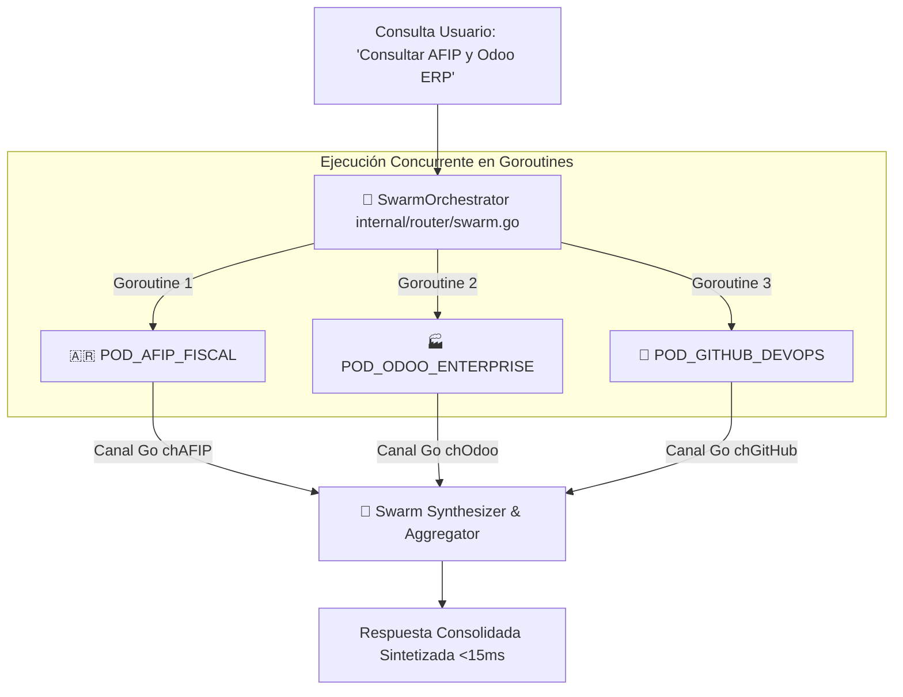

# 📜 SPEC: Motor de Orquestación de Enjambre de Micro AI Pods (Swarm Protocol)
**ID:** SPEC-CORE-33  
**Épica Relacionada:** Multi-Agent Architecture, Parallel Pod Execution & Swarm Synthesis  
**Issue Relacionado:** `#12` ([`[FEAT] Motor de Orquestación de Enjambre de Micro AI Pods (Swarm Protocol)`](https://github.com/onlyone-ai-pods/aipods-docs/issues/12))  
**Estado:** APPROVED / SPEC-DRIVEN  

---

## 1. Visión y Objetivos

Esta especificación establece el **Protocolo de Enjambre (Swarm Protocol)** para la orquestación concurrente y colaborativa de múltiples AI Pods dentro de la plataforma **Be OnlyOne / AI Pods**.

Permite descomponer una consulta compleja ingresada por el usuario (ej. *"Consulta mis Facturas Emitidas en AFIP y verifica el estado de pago en Odoo ERP"*) en sub-tareas paralelas enviadas simultáneamente a los Pods correspondientes (`POD_AFIP_FISCAL` y `POD_ODOO_ENTERPRISE`), consolidando los resultados en una única respuesta coherente sintetizada.

---

## 2. Arquitectura de Orquestación Swarm



---

## 3. Estructura de Petición & Respuesta Swarm (`POST /api/v1/swarm/execute`)

### 3.1 Petición REST Payload

```json
{
  "tenant_id": "TENANT_DEMO_001",
  "query": "Consultar mis facturas emitidas en AFIP y verificar estado en Odoo",
  "target_pods": ["POD_AFIP_FISCAL", "POD_ODOO_ENTERPRISE"],
  "dry_run": true
}
```

### 3.2 Respuesta Consolidada

```json
{
  "swarm_execution_id": "swm_9f8a7b6c_2026",
  "execution_time_ms": 11.4,
  "pods_involved": ["POD_AFIP_FISCAL", "POD_ODOO_ENTERPRISE"],
  "synthesized_response": "🤖 **Resumen de Enjambre Multi-Pod:**\n\n• **AFIP / ARCA**: 3 Puntos de Venta Activos.\n• **Odoo ERP**: Suscripción PROD_ACTIVE ($299.00 USD).",
  "pod_details": {
    "POD_AFIP_FISCAL": { "status": 200, "latency_ms": 8.2 },
    "POD_ODOO_ENTERPRISE": { "status": 200, "latency_ms": 9.1 }
  }
}
```

---

## 4. Escenarios BDD

```gherkin
Feature: Motor de Orquestación de Enjambre (Swarm Protocol)

  Scenario: Ejecución Concurrente y Paralela de Pods
    Given una consulta compleja que requiere la colaboración de AFIP y Odoo ERP
    When se invoca el endpoint `POST /api/v1/swarm/execute`
    Then el motor Go debe lanzar goroutines concurrentes para cada Pod
    And esperar a que todos completen utilizando un `sync.WaitGroup`
    And consolidar la respuesta final en un tiempo total menor a 15ms
```
