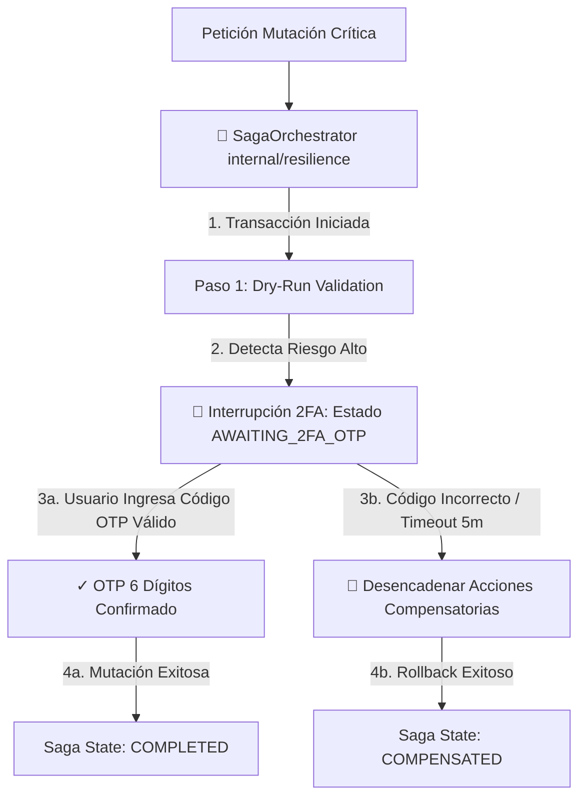

# 📜 SPEC: Motor de Resiliencia Enterprise & Patrón Saga con Interrupción 2FA OTP
**ID:** SPEC-CORE-35  
**Épica Relacionada:** Resiliency Architecture, Saga Transaction Orchestrator & 2FA Step-up Verification  
**Issue Relacionado:** `#13` ([`[FEAT] Motor de Resiliencia Enterprise (2FA OTP Interruption, NATS JobId, Saga Pattern & Policy Rulesets)`](https://github.com/onlyone-ai-pods/aipods-docs/issues/13))  
**Estado:** APPROVED / SPEC-DRIVEN  

---

## 1. Visión y Objetivos

Esta especificación define el **Motor de Resiliencia Enterprise (Saga Pattern Orchestrator)** para la ejecución de transacciones distribuidas complejas dentro de la plataforma **Be OnlyOne / AI Pods**.

Implementa un mecanismo de seguridad **Step-Up Authentication (Interrupción 2FA OTP)**: cuando un AI Pod intenta ejecutar una acción de mutación crítica (ej. revocar credenciales en ARCA/AFIP o eliminar registros en Odoo ERP), la transacción Saga se suspende en estado `AWAITING_2FA_OTP`. Un token de 6 dígitos debe ser ingresado y validado antes de proseguir; si el código no se proporciona o expira en 5 minutos, la Saga ejecuta acciones compensatorias de compensación/rollback automático.

---

## 2. Flujo de Transacción Saga con Interrupción 2FA



---

## 3. Especificación de Endpoints API

### 3.1 Iniciar Transacción Saga (`POST /api/v1/saga/start`)

**Payload:**
```json
{
  "tenant_id": "TENANT_DEMO_001",
  "action_name": "revocar_certificados_afip",
  "is_critical": true
}
```

**Respuesta:**
```json
{
  "saga_id": "saga_99120a8f",
  "status": "AWAITING_2FA_OTP",
  "message": "Mutación crítica detectada. Ingrese el código 2FA OTP para proceder.",
  "otp_required": true
}
```

### 3.2 Verificar OTP & Confirmar Saga (`POST /api/v1/saga/verify-otp`)

**Payload:**
```json
{
  "saga_id": "saga_99120a8f",
  "otp_code": "123456"
}
```

---

## 4. Escenarios BDD

```gherkin
Feature: Motor de Resiliencia Enterprise & Patrón Saga con Interrupción 2FA OTP

  Scenario: Interrupción 2FA de Acción Crítica y Aprobación Exitosa
    Given un usuario intentando ejecutar una mutación de alto riesgo en un AI Pod
    When la transacción Saga es iniciada mediante `POST /api/v1/saga/start`
    Then el motor debe cambiar el estado a `AWAITING_2FA_OTP` y requerir código de 6 dígitos
    And al enviar el código OTP válido mediante `POST /api/v1/saga/verify-otp`
    Then la transacción debe ejecutarse limpiamente pasando a estado `COMPLETED`

  Scenario: Rollback Compensatorio por Fallo en OTP
    Given una transacción Saga suspendida en `AWAITING_2FA_OTP`
    When se ingresa un código OTP inválido o expira la ventana de tiempo
    Then el motor debe ejecutar la función compensatoria y cambiar el estado a `COMPENSATED`
```
