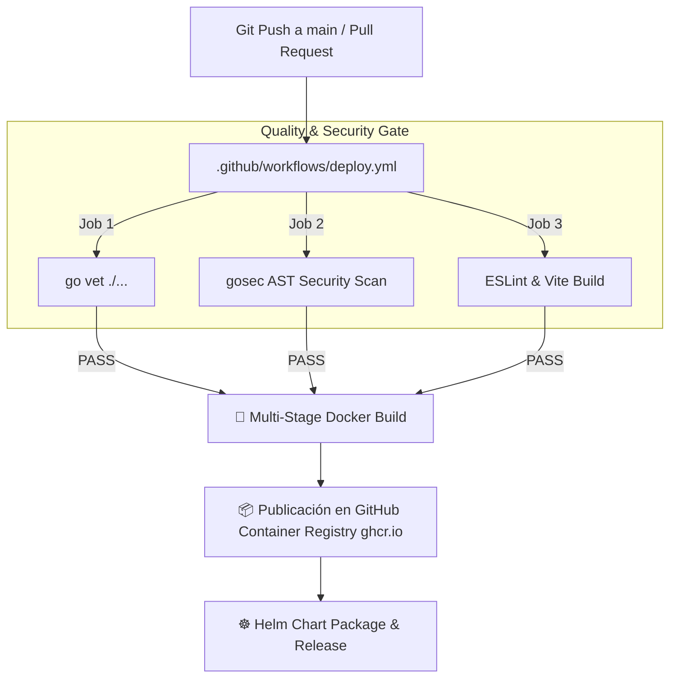

# 📜 SPEC: Pipeline CI/CD Automático en GitHub Actions, Docker & Helm Charts
**ID:** SPEC-CORE-36  
**Épica Relacionada:** DevOps Architecture, Continuous Integration / Deployment & Cloud-Native Packaging  
**Issue Relacionado:** `#3` / `#23` ([`[FEAT] Pipeline de CI/CD Automático en GitHub Actions con Docker y Helm`](https://github.com/onlyone-ai-pods/aipods-docs/issues/3))  
**Estado:** APPROVED / SPEC-DRIVEN  

---

## 1. Visión y Objetivos

Esta especificación establece el **Pipeline de Integración y Despliegue Continuo (CI/CD)** unificado para la plataforma **Be OnlyOne / AI Pods**.

Asegura que cada commit y pull request ejecutado contra la rama `main` en los 4 repositorios segregados pase por:
1. **Quality & Security Gate**: Análisis AST estático `go vet`, escaneo AST `gosec` (0 vulnerabilidades) y linter `ESLint` en React.
2. **Empaquetado de Imágenes Docker**: Compilación multi-stage minimizando el footprint final (<20MB para Go binario).
3. **Publicación de Charts de Helm**: Plantillas de manifiestos de Kubernetes para despliegue en Kubernetes (EKS, GKE, K3s, MicroK8s).

---

## 2. Arquitectura del Workflow CI/CD



---

## 3. Estructura de Helm Chart (`helm/aipods-core/`)

```yaml
# Chart.yaml
apiVersion: v2
name: aipods-core-engine
description: Helm Chart de despliegue para Be OnlyOne AI Pods Enterprise SaaS Platform
type: application
version: 63.0.0
appVersion: "63.0.0"
```

---

## 4. Escenarios BDD

```gherkin
Feature: Pipeline CI/CD Automático en GitHub Actions, Docker & Helm

  Scenario: Ejecución Exitosa del Quality Gate y Compilación Docker
    Given un commit enviado al repositorio `aipods-core-engine`
    When GitHub Actions dispara el workflow `.github/workflows/deploy.yml`
    Then debe validar los analisis `go vet` y `gosec` con 0 errores
    And construir una imagen Docker multi-stage optimizada menor a 30MB

  Scenario: Generación del Chart de Helm para Kubernetes
    Given la imagen Docker etiquetada correctamente con la versión de Release
    When se ejecuta la etapa de empaquetado de Helm
    Then debe generar el paquete `aipods-core-engine-63.0.0.tgz` listo para `helm install`
```
