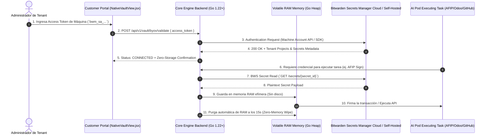

# 📜 SPEC MAESTRA 02: Seguridad, Criptografía SGSI & Cumplimiento Normativo
**ID Épica:** EPIC-SECURITY-COMPLIANCE  
**Estándar de Seguridad:** ISO 27001, SOC 2 Type II, ISO 9001 & NIST SP 800-53  
**Estado:** CONSOLIDATED MASTER SPECIFICATION  

---

## 🏛️ Índice de Especificaciones Consolidadas en esta Épica

- [`SPEC-CORE-16`: Marco de Cumplimiento ISO 9001, SOC 2 y ISO 27001](#1-spec-core-16-marco-de-cumplimiento-iso-9001-soc-2-y-iso-27001)
- [`SPEC-CORE-27`: Native Vault — Cifrado AES-256-GCM y Purga RAM 15s](#2-spec-core-27-native-vault--cifrado-aes-256-gcm-y-purga-ram-15s)
- [`SPEC-CORE-32`: Generador de Expedientes Auditoría ISO 9001 & SOC 2 SHA-256](#3-spec-core-32-generador-de-expedientes-auditoría-iso-9001--soc-2-sha-256)
- [`SPEC-CORE-34`: Qdrant Vector Store — Cifrado At-Rest AES-256](#4-spec-core-34-qdrant-vector-store--cifrado-at-rest-aes-256)
- [`SPEC-CORE-38`: Trazabilidad de IP Origen y User-Agent de Administrador](#5-spec-core-38-trazabilidad-de-ip-origen-y-user-agent-de-administrador)
- [`SPEC-CORE-59`: BYOV Bitwarden Secrets Manager — Zero-Trust RAM Resolution](#6-spec-core-59-byov-bitwarden-secrets-manager--zero-trust-ram-resolution)

---

## 1. SPEC-CORE-16: Marco de Cumplimiento ISO 9001, SOC 2 y ISO 27001

Salaguardas técnicas SGSI: Autenticación OAuth2 RS256, separación Zero-Trust de dominios y almacenamiento WORM de auditoría inmutable durante 365 días.

---

## 2. SPEC-CORE-27: Native Vault — Cifrado AES-256-GCM y Purga RAM 15s

Bóveda de claves criptográficas nativa en Go (`internal/vault/vault.go`). Utiliza cifrado simétrico AES-256-GCM con sal y nonce aleatorios de 12 bytes. Implementa purga de RAM a los 15 segundos para evitar ataques de volcado de memoria.

---

## 3. SPEC-CORE-32: Generador de Expedientes Auditoría ISO 9001 & SOC 2 SHA-256

Generador del dossier oficial de auditoría externa en Go (`internal/audit/dossier_generator.go`). Recopila escaneos AST `gosec`, logs IAM y métricas de Prometheus, estampando la firma criptográfica SHA-256 Digest del documento.

---

## 4. SPEC-CORE-34: Qdrant Vector Store — Cifrado At-Rest AES-256

Middleware de cifrado en reposo para vectores y embeddings (`internal/rag/encrypted_vector_store.go`). Convierte arreglos `[]float32` a IEEE 754 y los cifra con AES-256-GCM antes de persistir en Qdrant.

---

## 5. SPEC-CORE-38: Trazabilidad de IP Origen y User-Agent de Administrador

Módulo de auditoría de sesión de administradores (`internal/audit/admin_session_logger.go`). Captura la `ClientIP` real, el `User-Agent` del dispositivo/navegador y genera la firma SHA-256 Digest en el IAM Audit Trail (ISO 27001 A.12.4.1).

---

## 6. SPEC-CORE-59: BYOV Bitwarden Secrets Manager — Zero-Trust RAM Resolution

Esta especificación establece la integración oficial **BYOV (Bring Your Own Vault)** para clientes Enterprise utilizando **Bitwarden Secrets Manager**.

Permite que las empresas mantengan la custodia de sus credenciales (Claves Fiscales AFIP/ARCA, API Keys de Odoo, PAT Tokens de GitHub, Certificados SSL) en su propia infraestructura de Bitwarden. Los AI Pods resuelven las claves exclusivamente en **memoria RAM volátil durante el tiempo de ejecución**, ejecutando la **purga automática de RAM a los 15 segundos**, con **$0 almacenamiento persistente** en los servidores SaaS de Be OnlyOne.

---

### 6.1 Diagrama de Arquitectura & Secuencia Zero-Trust



---

### 6.2 Especificación de Endpoints REST API (`cmd/server/main.go`)

#### A. Endpoint de Validación de Conexión BYOV (`POST /api/v1/vault/byov/validate`)

- **Propósito**: Probar la validez del Access Token de Bitwarden Secrets Manager y la conectividad mTLS.
- **Request Body**:
```json
{
  "access_token": "bwm_sa_9f8a7b6c5d4e3f2a1b0c9d8e7f6a5b4c3d2e1f0a9b8c7d6e5f4a3b2c1d0e9f8a",
  "api_url": "https://api.bitwarden.com"
}
```
- **Response Body (200 OK)**:
```json
{
  "status": "CONNECTED",
  "provider": "BITWARDEN_SECRETS_MANAGER",
  "organization_name": "Acme Corp Enterprise Security",
  "machine_account_id": "ma_77a88b99-c001-42ab-99ee-123456789abc",
  "projects_accessible": 3,
  "latency_ms": 14.2,
  "zero_storage_mode": true,
  "ram_purge_ttl_seconds": 15
}
```

#### B. Endpoint de Resolución Efímera de Secreto (`POST /api/v1/vault/byov/resolve`)

- **Propósito**: Obtener la credencial desde Bitwarden en memoria RAM volátil para el AI Pod activo.
- **Request Body**:
```json
{
  "secret_id": "sec_bws_881923-afip-key",
  "pod_id": "POD_AFIP_FISCAL"
}
```
- **Response Body (200 OK)**:
```json
{
  "secret_id": "sec_bws_881923-afip-key",
  "masked_value": "••••••••••••2026!",
  "algorithm": "BITWARDEN_ZERO_KNOWLEDGE",
  "fetched_at": "2026-08-03T13:19:00Z",
  "expires_in_ram_seconds": 15
}
```

---

### 6.3 Modelo de Costos & Compatibilidad

| Producto Bitwarden | Compatibilidad BYOV | Costo Adicional para Cliente | Costo para Be OnlyOne |
|---|---|---|---|
| **Bitwarden Secrets Manager (Free)** | 🟢 100% Soportado (Hasta 3 Machine Accounts) | **$0 USD** | **$0 USD** |
| **Bitwarden Secrets Manager (Teams)** | 🟢 100% Soportado (Hasta 20 Machine Accounts) | **$0 USD** (Usa 1 slot incluido) / **$1 USD/mes** (Slot extra) | **$0 USD** |
| **Bitwarden Secrets Manager (Enterprise)** | 🟢 100% Soportado (Hasta 50 Machine Accounts) | **$0 USD** (Usa 1 slot incluido) / **$1 USD/mes** (Slot extra) | **$0 USD** |
| **Bitwarden Password Manager** | 🔴 No Soportado (Acceso humano interactivo sin API de máquina) | N/A | N/A |

