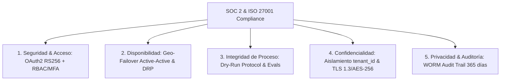

# 📜 SPEC: Marco de Cumplimiento ISO 9001, SOC 2 y ISO 27001
**ID:** SPEC-CORE-16  
**Épica Relacionada:** Certificaciones Internacionales, Gestión de Calidad (QMS) & Seguridad SGSI  
**Estado:** PROPOSED / SPEC-DRIVEN  

---

## 1. Visión General

Esta especificación establece el marco de controles técnicos, procesos de calidad y salvaguardas de seguridad necesarios para que la plataforma AI Pods obtenga y mantenga las certificaciones internacionales **ISO 9001** (Gestión de la Calidad), **SOC 2 Type II** (Confianza, Disponibilidad y Privacidad) e **ISO 27001** (Sistema de Gestión de Seguridad de la Información - SGSI).

---

## 2. Controles de Cumplimiento ISO 9001 (Sistema de Gestión de la Calidad)

ISO 9001 exige demostrar **control de calidad en los procesos de software, trazabilidad total y mejora continua de la satisfacción del cliente**:

| Requisito ISO 9001 | Mecanismo de Implementación en el Proyecto | Control Técnico / Evidencia |
| :--- | :--- | :--- |
| **Control de Cambios & Trazabilidad** | Metodología **Spec-Driven Development (SDD)** + Commits estándar de Odoo + Versionado Semántico (`VERSION`). | Historial Git trazable desde la Historia de Usuario hasta el código compilado. |
| **Aseguramiento de Calidad (QA)** | Suite de Evals de RAG sobre Golden Datasets automatizados en CI/CD. | Bloqueo de deployments si la precisión es $<95\%$ o las alucinaciones $>1\%$. |
| **Mejora Continua & Feedback del Cliente** | Captura continua de feedback de usuarios (Thumbs Up/Down) e invalidación de caché reactiva. | Tablero de satisfacción de usuarios y métricas de errores en Grafana. |
| **Gobernanza de Proceso & Estandarización** | Linters estáticos (`golangci-lint`, `ESLint`) y Agentic Skills Kit (`.aipods/skills/`). | Verificación automatizada de código limpio en pre-commit y CI. |

---

## 3. Controles de Cumplimiento SOC 2 (Type II) & ISO 27001 (SGSI)

SOC 2 e ISO 27001 exigen controles de seguridad rigurosos divididos en 5 Criterios de Confianza (*Trust Services Criteria*):



### 3.1 Criterio 1: Seguridad (Security & Access Control)
* **Autenticación & JWT:** Firma asimétrica **RS256** con OAuth 2.0 / OIDC y MFA obligatorio para administradores.
* **Separación de Dominios (Zero-Trust):** Subredes y portales web 100% aislados entre clientes (`app.aipods.com`) y administración (`admin-internal.aipods.com`).
* **Análisis de Vulnerabilidades:** Escaneo estático con `gosec`, escaneo de secreto con `gitleaks` y escaneo de imágenes Docker con `Trivy`.

### 3.2 Criterio 2: Disponibilidad (Availability & DRP)
* **Infraestructura Multi-Sitio:** Redis Enterprise Active-Active y NATS JetStream para funcionamiento ininterrumpido.
* **Métricas DRP:** $\text{RPO} < 1 \text{ minuto}$ y $\text{RTO} < 5 \text{ minutos}$. Pruebas de simulación de desastre semestrales.

### 3.3 Criterio 3: Integridad del Procesamiento (Processing Integrity)
* **Protocolo Mandatorio Dry-Run:** Ninguna herramienta con efecto secundario muta datos en Odoo/SAP sin simulación previa y token de confirmación humana (*Human-in-the-Loop*).

### 3.4 Criterio 4: Confidencialidad (Confidentiality & Data Protection)
* **Cifrado Total:** Cifrado en tránsito con **TLS 1.3** y cifrado en reposo con **AES-256** en PostgreSQL 16, Qdrant y Redis.
* **Invariante Multi-Tenant:** Consulta filtrada obligatoriamente por metadatos `WHERE tenant_id == X OR tenant_id == 'GLOBAL'`.

### 3.5 Criterio 5: Privacidad & Auditoría Inmutable (Privacy & Audit Logging)
* **Audit Trail Inmutable:** Registros de auditoría almacenados en PostgreSQL / Buckets S3 con **Object Lock (WORM - Write Once Read Many)**.
* **Trazabilidad de Sesión de Administrador (`admin_session_logger.go`):** Captura obligatoria de `ClientIP`, `User-Agent` del navegador y generación de firma criptográfica **SHA-256 Digest** en cada login o mutación administrativa.
* **Retención de Logs:** Retención mínima de **365 días** accesible únicamente por Auditores de Seguridad.

---

## 4. Escenario BDD de Auditoría SOC 2 / ISO 27001

```gherkin
Given un auditor de seguridad solicitando la evidencia de auditoría para la consulta "REQ-8899"
When el oficial de seguridad consulta el sistema de auditoría OTel / PostgreSQL Audit Trail
Then el sistema debe retornar el registro completo firmado inmutable conteniendo:
     TraceID, TenantID, UserID, PromptHash, ModelUsed, TokensCount, CitationsJSON y Timestamp
And demostrar que los datos del tenant permanecieron aislados durante toda la transacción
```
