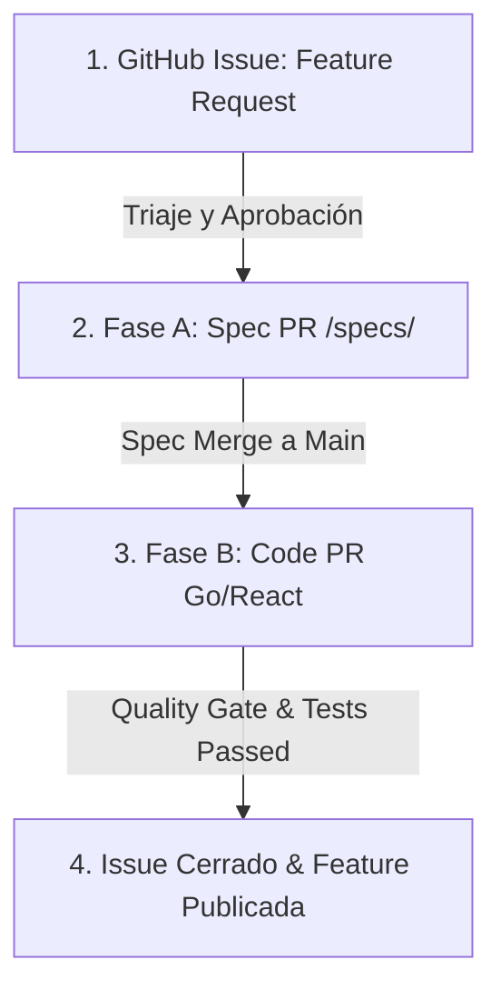

# 📜 SPEC: Gobernanza de GitHub Issues para Nuevas Características (Feature Requests)

**ID:** SPEC-CORE-24  
**Épica Relacionada:** Gobernanza de Requerimientos, SDD Traceability & Lifecycle Management  
**Estado:** PROPOSED / SPEC-DRIVEN  

---

## 1. Visión y Objetivos

Esta especificación establece el flujo estandarizado para la proposición, evaluación, diseño y seguimiento de **nuevas características (Feature Requests)** dentro de la plataforma **AI Pods Enterprise SaaS** mediante el uso estructurado de **GitHub Issues** en la organización **`onlyone-ai-pods`**.

Garantiza la trazabilidad $100\%$ desde la idea inicial del negocio hasta la entrega en código producción, evitando el desarrollo de características "huérfanas" no documentadas.

---

## 2. Ciclo de Vida de una Nueva Característica (Feature Lifecycle)

Toda nueva funcionalidad DEBE atravesar estrictamente 4 etapas ordenadas:



1. **Etapa 1 - Propuesta (GitHub Issue):** Registro formal del requerimiento por un cliente, desarrollador o gerente de producto.
2. **Etapa 2 - Especificación SDD (Spec PR):** Creación de un documento de diseño ejecutable `.md` en `aipods-docs/specs/` referenciando el Issue `#ID`.
3. **Etapa 3 - Desarrollo e Integración (Code PR):** Implementación en Go o React respaldada por la Spec aprobada.
4. **Etapa 4 - Cierre y Verificación (Issue Closure):** Verificación con `test_functional_e2e.sh` y cierre automático del Issue vía Git commit (`Closes #ID`).

---

## 3. Plantilla Estándar de GitHub Issue (Issue Template)

Todo Issue de nueva característica DEBE ser creado utilizando el prefijo **`[FEAT]`** y responder a la siguiente plantilla normalizada:

```markdown
---
name: 🚀 Feature Request / Nueva Característica
about: Sugerir una nueva funcionalidad o AI Pod para la plataforma AI Pods Enterprise.
title: '[FEAT] <Nombre corto de la característica>'
labels: 'feature, needs-spec'
assignees: ''
---

### 💡 Descripción de la Necesidad / Justificación de Negocio
Describe claramente qué problema resuelve esta nueva característica y por qué es valiosa para la plataforma o para un cliente.

### 🎯 Criterios de Aceptación Preliminares (Gherkin BDD)
```gherkin
Given un usuario o cliente interactuando con la plataforma
When solicita o ejecuta <accion>
Then el sistema o AI Pod debe <resultado esperado>
```

### 🧩 AI Pods y Componentes Impactados
Marque los módulos que se verán afectados:
- [ ] Backend Core Engine Go (`aipods-core-engine`)
- [ ] Customer Portal Frontend (`aipods-frontend-customer`)
- [ ] Admin Review Hub Frontend (`aipods-frontend-admin`)
- [ ] Nuevo AI Pod (Especificar nombre: `POD_...`)

### 📜 Trazabilidad SDD (Spec Relacionada)
- Especificación propuesta: `specs/0X_category/XX_feature_spec.md` (A llenar en Fase A)
```

---

## 4. Clasificación por Etiquetas (Labels System)

Los Issues serán clasificados mediante la siguiente taxonomía oficial:

| Etiqueta (Label) | Color Hex | Descripción & Uso |
| :--- | :--- | :--- |
| **`feature`** | `#a2eeef` | Identifica una solicitud de nueva funcionalidad. |
| **`needs-spec`** | `#d4c5f9` | Indica que el Issue está aprobado pero requiere escribir su Spec SDD. |
| **`spec-approved`** | `#0e8a16` | La especificación fue integrada a `main` en `aipods-docs`. |
| **`pod-core`** | `#1d76db` | Impacta el motor Go (`aipods-core-engine`). |
| **`pod-essential`** | `#b60205` | AI Pod vital para cobro, seguridad o fiscalidad SaaS. |
| **`pod-dynamic`** | `#fbca04` | AI Pod de dominio opcional (carga dinámicamente en caliente). |
| **`frontend-customer`**| `#0052cc` | Impacta el Portal de Clientes React 18. |
| **`frontend-admin`** | `#5319e7` | Impacta el Portal de Administración React 18. |

---

## 5. Gestión Eficiente con GitHub CLI (`gh issue`)

Para el equipo de desarrollo, la creación y triaje de Issues se realiza directamente desde la terminal mediante **`gh`**:

```bash
# 1. Crear un nuevo Issue de Feature desde la terminal
gh issue create \
  --repo onlyone-ai-pods/aipods-docs \
  --title "[FEAT] AI Pod Notificaciones Push via Telegram" \
  --body "Solicitud para integrar un Pod de alertas push vía bot de Telegram para cobros." \
  --label "feature,needs-spec,pod-dynamic"

# 2. Listar Issues abiertos de nuevas características
gh issue list --repo onlyone-ai-pods/aipods-docs --label "feature"

# 3. Vincular un commit y Pull Request para cerrar el Issue automáticamente
git commit -m "[ADD] core: implement Telegram Push Pod. Closes #42"
```

---

## 6. Regla Inviolable de Trazabilidad

> *"No se permite mergear ningún Pull Request de código (`feat/`) a la rama main si no existe un GitHub Issue abierto con la etiqueta `spec-approved` y su correspondiente archivo `.spec.md` en `aipods-docs`."*
