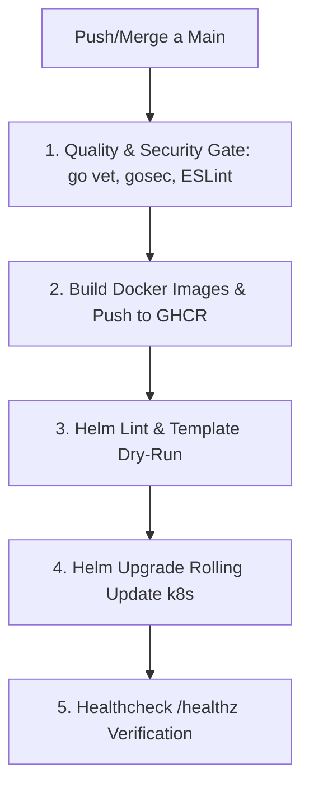

# 📜 SPEC: Pipeline de CI/CD Automático en GitHub Actions con Docker & Helm Chart

**ID:** SPEC-CORE-26  
**Épica Relacionada:** Despliegue Continuo, Contenerización Docker, Kubernetes & Helm Governance  
**Issue Relacionado:** `#3` ([`[FEAT] Pipeline de CI/CD Automático en GitHub Actions con Docker y Helm`](https://github.com/onlyone-ai-pods/aipods-docs/issues/3))  
**Estado:** PROPOSED / SPEC-DRIVEN  

---

## 1. Justificación Arquitectónica: ¿Por qué Helm en AI Pods Enterprise?

### El Reto en Entornos SaaS Multi-Tenant:
Sin Helm, desplegar la plataforma en Kubernetes requiere mantener decenas de archivos YAML estáticos (`deployment.yaml`, `service.yaml`, `ingress.yaml`) duplicados por cada entorno (Dev, Staging, Prod) y por cada cliente corporativo.

### Las Bondades de Helm:
1. **Administrador de Paquetes Unificado:** Helm actúa como el gestor de paquetes de Kubernetes, agrupando todo en un único **Helm Chart (`aipods-platform`)**.
2. **Despliegue Multi-Tenant en 1 Comando:** Permite aprovisionar instancias aisladas parametrizando variables de entorno:
   ```bash
   helm install tenant-acme ./helm/aipods-platform --set tenantId=acme --set domain=acme.aipods.io
   ```
3. **Rollbacks Inmediatos en 1 Segundo:** Ante cualquier falla en producción, restaura la versión anterior instantáneamente:
   ```bash
   helm rollback aipods-prod 1
   ```
4. **Despliegues sin Interrupción (Zero-Downtime Rolling Updates):** Actualiza réplicas de Pods de Go y React de forma progresiva manteniendo el servicio activo.

---

## 2. Estructura del Helm Chart (`helm/aipods-platform/`)

```text
helm/aipods-platform/
├── Chart.yaml                # Metadatos del Chart v1.0.0
├── values.yaml               # Valores por defecto (Go 8080, Customer 3000, Admin 3001)
├── values-staging.yaml       # Sobrescrituras para entorno Staging
├── values-prod.yaml          # Sobrescrituras para Producción Enterprise
└── templates/
    ├── engine-deployment.yaml  # Go Core Engine + HorizontalPodAutoscaler (HPA)
    ├── engine-service.yaml     # Service ClusterIP Go Engine
    ├── frontend-customer.yaml  # Customer Portal React 18
    ├── frontend-admin.yaml     # Admin Review Hub React 18
    └── ingress.yaml            # Ingress Controller NGINX + Cert-Manager TLS (HTTPS)
```

---

## 3. Workflow de GitHub Actions (`.github/workflows/ci-cd.yml`)



---

## 4. Criterios de Aceptación (Gherkin BDD)

```gherkin
Feature: Pipeline de CI/CD Automático en GitHub Actions con Docker y Helm Chart

  Scenario: Construcción y Publicación de Imágenes Docker en GHCR (Write Path)
    Given un desarrollador haciendo merge de un PR a la rama `main`
    When GitHub Actions ejecuta el workflow `.github/workflows/ci-cd.yml`
    Then debe compilar la imagen Docker del backend Go y de los 2 frontends React
    And etiquetar las imágenes con el tag semántico (ej: `ghcr.io/onlyone-ai-pods/engine:v16.0.0`)
    And superar el Quality Gate (`go vet`, `gosec`, `ESLint`) con 0 vulnerabilidades antes del push

  Scenario: Despliegue Automatizado con Helm Chart (CD Pipeline)
    Given las imágenes Docker publicadas en GHCR
    When el paso de CD invoca `helm upgrade --install aipods-prod ./helm/aipods-platform`
    Then Kubernetes debe actualizar los Pods de la plataforma aplicando Rolling Update sin downtime
    And verificar el healthcheck de `/healthz` en menos de 30 segundos

  Scenario: Rollback Automático ante Fallo de Despliegue (Failure Case)
    Given un despliegue de Helm donde el backend Go falla el healthcheck `/healthz`
    When Kubernetes detecta que los Pods quedan en estado `CrashLoopBackOff`
    Then GitHub Actions debe invocar automáticamente `helm rollback aipods-prod`
    And restaurar la versión estable anterior inmediatamente
    And notificar la falla al equipo vía webhook de alerta

  Scenario: Simulación Dry-Run (`dry_run = true`)
    Given la ejecución del comando `helm template --dry-run ./helm/aipods-platform`
    When se valida la plantilla del Chart
    Then debe generar los manifiestos YAML sin aplicar cambios en el clúster
    And verificar la sintaxis de las variables de entorno multi-tenant
```
