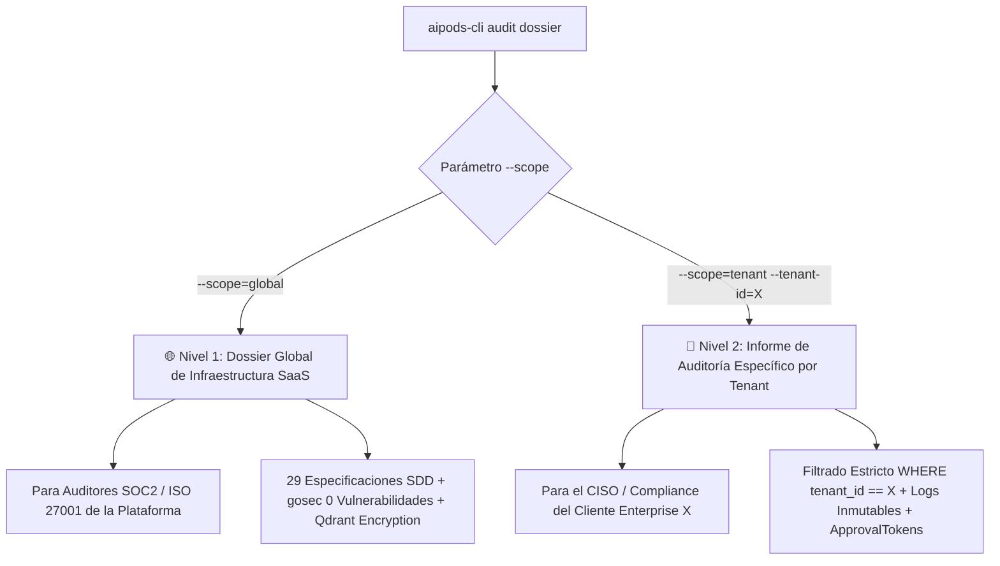

# 📜 SPEC: Compilador del Dossier Normativo ISO 9001 & SOC 2 Type II (Global & Tenant-Level)

**ID:** SPEC-CORE-27  
**Épica Relacionada:** Cumplimiento Normativo, Dossier de Auditoría & Material Comercial Enterprise  
**Issue Relacionado:** `#9` ([`[FEAT] Generación Automática del Dossier ISO 9001 & SOC 2 Type II`](https://github.com/onlyone-ai-pods/aipods-docs/issues/9))  
**Estado:** PROPOSED / SPEC-DRIVEN  

---

## 1. Justificación de Negocio & Habilitador Comercial Enterprise

El generador del Dossier Normativo de Calidad y Seguridad (`aipods-cli audit dossier`) cumple un doble propósito estratégico:

1. **Cumplimiento y Auditoría Interna/Externa:** Compila automáticamente las especificaciones SDD, análisis de linters de código (`gosec` 0 vulnerabilidades, `go vet`, `ESLint`), pruebas BDD (`godog`) y registros inmutables de auditoría.
2. **Habilitador Comercial y Material de Marketing Enterprise:** Genera documentación auditable en formato PDF/HTML con firma digital OpenSSL que los equipos de ventas y compliance pueden entregar a prospectos corporativos (CISOs, directores de tecnología) para acelerar el cierre de contratos SaaS.

---

## 2. Arquitectura de Alcance Dual (Global vs. Por Tenant)



### Nivel 1: Dossier Global de la Plataforma (`--scope=global`)
- **Filtro:** Incluye todas las especificaciones SDD, matrices de linters y pruebas del sistema completo.
- **Uso:** Certificaciones SOC 2 Type II, ISO 9001, ISO 27001 y auditorías externas de infraestructura.

### Nivel 2: Informe de Auditoría por Tenant (`--scope=tenant --tenant-id=X`)
- **Filtro Estricto:** Extrae únicamente los logs de auditoría `audit_trail WHERE tenant_id == 'X'`.
- **Uso:** Reportes ejecutivos para CISOs de clientes corporativos (Banco Santander, Globant, Mercado Libre).

---

## 3. Comandos de la CLI (`aipods-cli`)

```bash
# 1. Generar Dossier Global en PDF con Firma Digital
aipods-cli audit dossier --scope=global --format=pdf --out=dossier_global_v19.0.0.pdf

# 2. Generar Reporte de Auditoría Aislado para un Cliente Específico
aipods-cli audit dossier --scope=tenant --tenant-id=tenant_acme_corp --format=pdf

# 3. Verificar Integridad de la Firma OpenSSL del Dossier
aipods-cli audit verify --dossier=dossier_global_v19.0.0.pdf --manifest=dossier_manifest.sha256
```

---

## 4. Criterios de Aceptación (Gherkin BDD)

```gherkin
Feature: Generación Automática del Dossier ISO 9001 & SOC 2 Type II (Global & Tenant-Level)

  Scenario: Generación del Dossier Global de Plataforma (Global Scope Path)
    Given un administrador ejecutando `aipods-cli audit dossier --scope=global --format=pdf`
    When la herramienta compila las especificaciones SDD, evidencias de linters y matriz BDD
    Then debe generar el archivo `dossier_global_iso9001_soc2_v19.0.0.pdf`
    And incluir la firma digital SHA-256 OpenSSL inmutable

  Scenario: Generación del Reporte de Auditoría Aislado por Tenant (Tenant Scope Path)
    Given un auditor ejecutando `aipods-cli audit dossier --scope=tenant --tenant-id=tenant_acme_corp`
    When la herramienta procesa el log de auditoría inmutable `audit_trail`
    Then debe aplicar filtrado estricto `WHERE tenant_id == 'tenant_acme_corp'`
    And garantizar que no se exponga ningún dato ni métrica pertenecientes a otros tenants

  Scenario: Verificación de Firma Digital de Integridad (Integrity Gate)
    Given el manifiesto `dossier_manifest.sha256` firmado con la clave privada de la organización
    When un auditor externo ejecuta `aipods-cli audit verify --dossier=dossier_global_v19.0.0.pdf`
    Then la firma digital OpenSSL debe ser validada exitosamente
    And confirmar que ninguna especificación ni log fue alterado tras su generación

  Scenario: Simulación Dry-Run (`dry_run = true`)
    Given la ejecución de la herramienta con el parámetro `--dry-run`
    When se simula la generación del Dossier
    Then debe retornar `IsDryRun: true` y `ActionName: "generar_dossier_iso9001_soc2"`
    And generar un `ApprovalToken` inmutable `dryrun_dossier_<hash>` sin escribir el archivo final en disco
```
