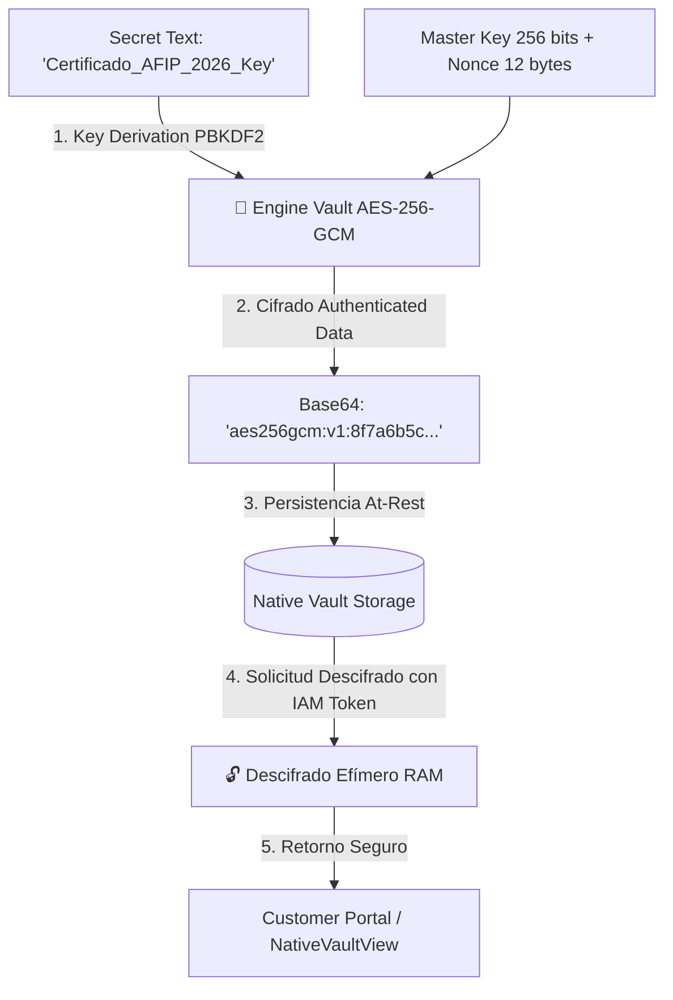

# 📜 SPEC: Native Vault — Cifrado At-Rest AES-256-GCM & Gestión de Secretos
**ID:** SPEC-CORE-27  
**Épica Relacionada:** Security & Compliance, Zero-Trust Storage & Customer Vault  
**Issue Relacionado:** `#11` ([`[FEAT] Módulo de Gestión de Secretos: Native Vault Cifrado AES-256`](https://github.com/onlyone-ai-pods/aipods-docs/issues/11))  
**Estado:** APPROVED / SPEC-DRIVEN  

---

## 1. Visión y Objetivos

Esta especificación establece el estándar de **Cifrado At-Rest AES-256-GCM** para la gestión de credenciales y secretos de integración (Certificados CUIT/AFIP, API Keys de Odoo, GitHub Personal Access Tokens).

Asegura que **ningún secreto se almacene en texto plano** en las bases de datos ni en disco. Todo secreto es cifrado antes de persistirse utilizando una clave criptográfica de 256 bits única por Tenant con vector de inicialización (Nonce) aleatorio.

---

## 2. Esquema de Cifrado Criptográfico (AES-256-GCM)



---

## 3. Endpoints REST API (`aipods-core-engine`)

| Método | Ruta | Descripción | Payload / Params |
|---|---|---|---|
| `GET` | `/api/v1/vault/secrets` | Lista secretos almacenados (enmascarados `••••••••`) | `tenant_id` |
| `POST` | `/api/v1/vault/secrets` | Cifra y guarda un nuevo secreto con AES-256 | `{ "key_name": "AFIP_CRT", "secret_value": "..." }` |
| `POST` | `/api/v1/vault/reveal` | Descifra temporalmente un secreto en memoria RAM | `{ "key_name": "AFIP_CRT" }` |

---

## 4. Estructura de Secreto Cifrado

```json
{
  "key_name": "ODOO_ENTERPRISE_API_KEY",
  "cipher_text": "aes256gcm:v1:e3b0c44298fc1c149afbf4c8996fb92427ae41e4649b934ca495991b7852b855",
  "masked_value": "••••••••••••3a9f",
  "algorithm": "AES-256-GCM",
  "created_at": "2026-07-31T02:58:00Z"
}
```

---

## 5. Escenarios BDD

```gherkin
Feature: Native Vault Cifrado At-Rest AES-256-GCM

  Scenario: Almacenamiento Seguro de Credenciales Cifradas
    Given un usuario en el Customer Portal agregando una API Key de Odoo
    When se envía la petición `POST /api/v1/vault/secrets`
    Then el motor Go debe cifrar el texto en plano utilizando AES-256-GCM con un Nonce aleatorio
    And almacenar únicamente la cadena cifrada en Base64

  Scenario: Descifrado Efímero con Auditoría IAM
    Given una credencial cifrada en el Native Vault
    When el usuario solicita revelar la credencial haciendo click en "👁️ Revelar"
    Then el motor Go debe descifrar en memoria RAM el valor original
    And generar un registro de auditoría SHA-256 indicando la consulta
```
