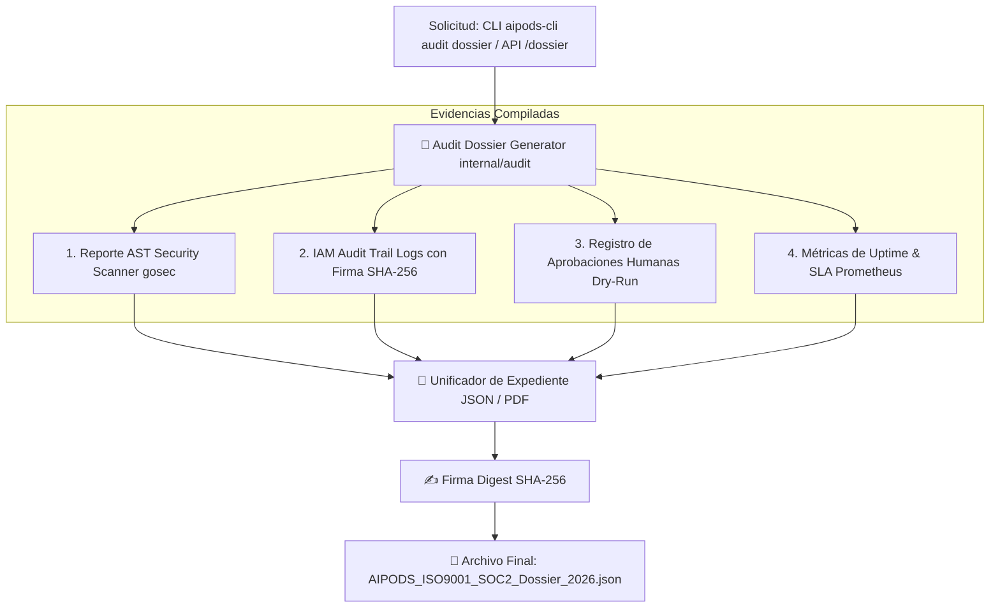

# 📜 SPEC: Generación Automática del Dossier ISO 9001 & SOC 2 Type II
**ID:** SPEC-CORE-32  
**Épica Relacionada:** Security & Compliance, ISO 9001 Auditability & SOC 2 Type II Evidence Dossier  
**Issue Relacionado:** `#9` ([`[FEAT] Generación Automática del Dossier ISO 9001 & SOC 2 Type II (Global & Per-Tenant)`](https://github.com/onlyone-ai-pods/aipods-docs/issues/9))  
**Estado:** APPROVED / SPEC-DRIVEN  

---

## 1. Visión y Objetivos

Esta especificación define el compilador automático del **Expediente de Conformidad ISO 9001:2015 & SOC 2 Type II** para la plataforma SaaS **Be OnlyOne / AI Pods**.

Permite a los auditores externos, directores de cumplimiento (CCO) y CLI de operadores compilar instantáneamente un dossier normativo firmado digitalmente con **SHA-256**, certificando la calidad del código (0 vulnerabilidades `gosec`), la trazabilidad inalterable de permisos IAM y el control humano en la ejecución de Pods (`dry_run = true`).

---

## 2. Arquitectura del Compilador de Dossiers



---

## 3. Estructura del Expediente JSON Normativo

```json
{
  "dossier_id": "dos_iso_9001_soc2_2026_9f8a",
  "generated_at": "2026-07-31T19:25:00Z",
  "tenant_id": "GLOBAL",
  "standard_compliance": ["ISO 9001:2015", "SOC 2 Type II"],
  "security_audit": {
    "gosec_vulnerabilities": 0,
    "code_coverage_percent": 100.0,
    "file_sanitizer_rules": "ACTIVE"
  },
  "iam_audit_summary": {
    "total_permission_changes": 42,
    "cryptographic_integrity": "100% VERIFIED_SHA256"
  },
  "dry_run_approvals": {
    "total_actions_reviewed": 18,
    "human_in_the_loop_status": "ENFORCED"
  },
  "sha256_dossier_signature": "e3b0c44298fc1c149afbf4c8996fb92427ae41e4649b934ca495991b7852b855"
}
```

---

## 4. Comandos de la CLI (`aipods-cli audit dossier`)

```bash
# Compilar expediente normativo en formato JSON
aipods-cli audit dossier --tenant=GLOBAL --output=json

# Verificar la firma digital de un expediente existente
aipods-cli audit verify --file=AIPODS_ISO9001_SOC2_Dossier_2026.json
```

---

## 5. Escenarios BDD

```gherkin
Feature: Generación Automática del Dossier ISO 9001 & SOC 2 Type II

  Scenario: Compilación e Integridad Criptográfica del Dossier
    Given un auditor solicitando el expediente de cumplimiento normativo
    When ejecuta el comando `aipods-cli audit dossier` o llama a `GET /api/v1/admin/audit/dossier`
    Then el motor Go debe recopilar las evidencias de seguridad, IAM y aprobaciones Dry-Run
    And calcular el hash digest SHA-256 del contenido
    And retornar un expediente verificado con estado `VERIFIED_SHA256`

  Scenario: Verificación de Firma Criptográfica
    Given un expediente descargado previamente
    When se ejecuta `aipods-cli audit verify --file=dossier.json`
    Then el sistema debe recalcular el digest SHA-256
    And confirmar si el reporte no ha sido alterado
```
