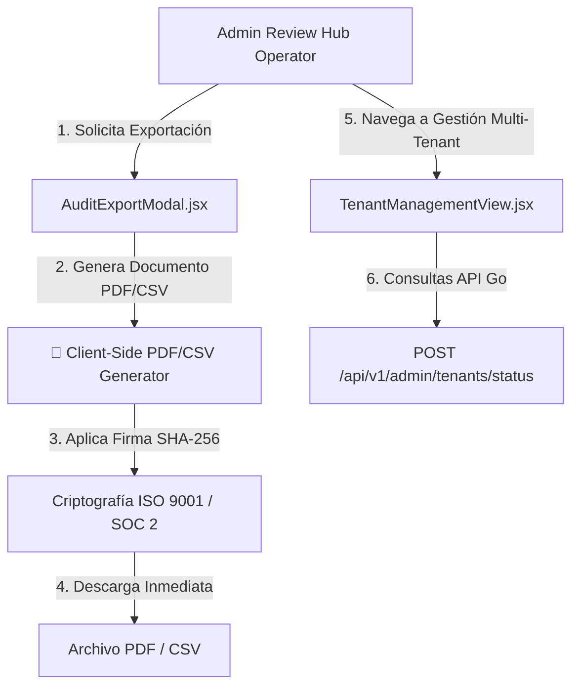

# 📜 SPEC: Exportación de Reportes PDF/CSV & Panel Multi-Tenant en Admin Hub
**ID:** SPEC-CORE-30  
**Épica Relacionada:** Admin Hub Governance, Compliance Export (ISO 9001 & SOC 2) & Tenant Management  
**Issue Relacionado:** `#7` ([`[FEAT] Exportación de Reportes PDF/CSV de Auditoría en Admin Review Hub`](https://github.com/onlyone-ai-pods/aipods-docs/issues/7))  
**Estado:** APPROVED / SPEC-DRIVEN  

---

## 1. Visión y Objetivos

Esta especificación define las capacidades de **Exportación de Reportes Normativos en PDF/CSV** y la **Gestión Multi-Tenant** dentro del **Admin Review Hub** (`aipods-frontend-admin`).

Permite a los directores de auditoría y administradores de la plataforma:
1. Exportar expedientes de aprobación Dry-Run e historiales IAM en **PDF firmado con SHA-256** y **CSV tabular**.
2. Administrar de forma centralizada las empresas clientes (Tenants), monitorear el consumo de tokens y controlar el estado de servicio (`PROD_ACTIVE`, `PENDING_PAYMENT`, `SUSPENDED`).

---

## 2. Arquitectura de Exportación & Gestión Multi-Tenant



---

## 3. Especificación del Reporte PDF Normativo

El archivo PDF generado incluirá:
- **Cabecera Oficial**: Marca *Be OnlyOne / AI Pods Enterprise Platform*.
- **Expediente de Aprobaciones**: Lista de acciones Dry-Run ejecutadas con fecha, usuario solicitante y resultado.
- **Sello de Integridad Criptográfica**: Hash SHA-256 único calculado sobre el contenido.
- **Leyenda de Cumplimiento**: *"Expediente válido para auditorías externas ISO 9001:2015 y SOC 2 Type II"*.

---

## 4. Panel de Gestión Multi-Tenant (`TenantManagementView.jsx`)

| Columna | Descripción | Acción |
|---|---|---|
| **Empresa / Tenant ID** | Razón Social y CUIT del Cliente | Ver detalle |
| **Plan Contratado** | Plan Odoo Billing (`Enterprise Multi-Pod`) | — |
| **Tokens Consumidos** | Consumo del mes vs Límite | Reset de Cuota |
| **Estado de Servicio** | `PROD_ACTIVE`, `SUSPENDED` | Toggle Suspender / Activar |

---

## 5. Escenarios BDD

```gherkin
Feature: Exportación de Reportes PDF/CSV & Gestión Multi-Tenant

  Scenario: Exportación de Expediente de Auditoría en PDF con Hash SHA-256
    Given un administrador en el Admin Review Hub
    When hace click en "📄 Exportar Reporte PDF"
    Then el sistema debe generar un documento PDF estructurado
    And adjuntar el hash de verificación criptográfica SHA-256 al pie de página

  Scenario: Suspensión Manual de un Tenant por Incumplimiento
    Given un operador administrando la lista de Tenants
    When cambia el switch de un Tenant a "SUSPENDED"
    Then el sistema debe enviar la solicitud a `POST /api/v1/admin/tenants/status`
    And la API Go debe bloquear el enrutamiento de peticiones HTTP 402 para ese tenant
```
