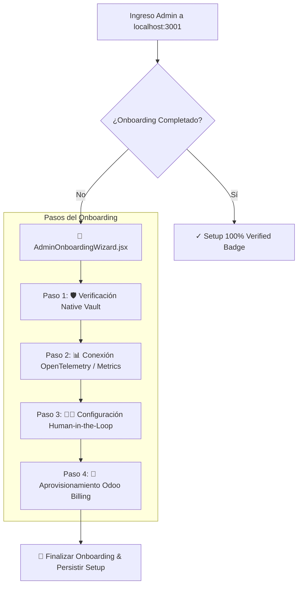

# 📜 SPEC: Admin Onboarding Checklist & Wizard de Bienvenida (4 Pasos)
**ID:** SPEC-CORE-37  
**Épica Relacionada:** Admin Hub UX, Onboarding Wizard & Enterprise Compliance Checklist  
**Issue Relacionado:** `#18` ([`[FEAT] Admin Hub Onboarding Checklist & Wizard de Bienvenida`](https://github.com/onlyone-ai-pods/aipods-docs/issues/18))  
**Estado:** APPROVED / SPEC-DRIVEN  

---

## 1. Visión y Objetivos

Esta especificación establece el **Wizard de Onboarding para Administradores y Senior Consultants** dentro del **Admin Review Hub** (`aipods-frontend-admin`).

Brinda una experiencia de bienvenida estructurada que guía al nuevo administrador en 4 pasos esenciales para dejar la plataforma Be OnlyOne totalmente operativa:
1. **Credenciales en Vault**: Configuración de claves AES-256 para AFIP, Odoo ERP y GitHub.
2. **Telemetría & Salud**: Confirmación de estado de salud `GET /healthz` y scraping `GET /metrics`.
3. **Reglas Human-in-the-Loop**: Confirmación de la política de revisión manual previa a mutación (`dry_run = true`).
4. **Suscripción & Multi-Tenant**: Verificación de empresas activas en Odoo Billing.

---

## 2. Arquitectura del Wizard de 4 Pasos



---

## 3. Estados y Progreso de Configuración

| Paso | Título | Indicador de Éxito | Acción del Administrador |
|---|---|---|---|
| **1** | **Vault de Secretos Cifrados** | `AES-256 Master Key OK` | Probar `StoreSecret` / `RevealSecret`. |
| **2** | **Telemetría & Métricas** | `Prometheus Scraping Active` | Verificar contador RPM y Redis Cache. |
| **3** | **Políticas Dry-Run** | `Human-in-the-Loop Enforced` | Probar simulador de aprobaciones pendientes. |
| **4** | **Aprovisionamiento Tenant** | `PROD_ACTIVE` | Confirmar cuota de tokens y razón social CUIT. |

---

## 4. Escenarios BDD

```gherkin
Feature: Admin Onboarding Wizard & Checklist de Bienvenida

  Scenario: Recorrido Completo del Wizard de Administrador
    Given un usuario ingresando al Admin Review Hub por primera vez
    When el sistema despliega el banner `AdminOnboardingWizard.jsx`
    Then el administrador puede avanzar paso a paso completando la verificación
    And al llegar al Paso 4 la barra de progreso alcanza el 100%
    And el banner puede colapsarse manteniendo el badge de setup verificado
```
