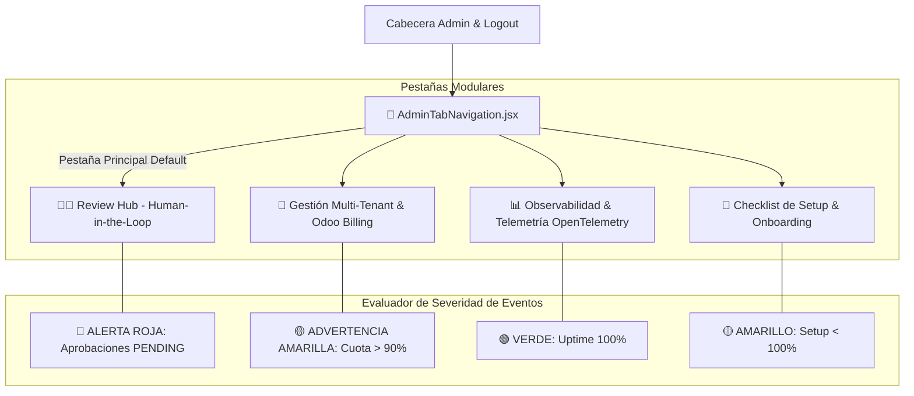

# 📜 SPEC: Rediseño Admin Hub — Navegación por Pestañas & Sistema de Alertas Visuales
**ID:** SPEC-CORE-39  
**Épica Relacionada:** Admin Hub UX, Tab Navigation Governance & Event Severity Badge System  
**Issue Relacionado:** `#20` ([`[FEAT] Rediseño Admin Hub: Navegación por Pestañas & Sistema de Alertas Visuales`](https://github.com/onlyone-ai-pods/aipods-docs/issues/20))  
**Estado:** APPROVED / SPEC-DRIVEN  

---

## 1. Visión y Objetivos

Esta especificación establece la reestructuración completa de la interfaz del **Admin Review Hub** (`aipods-frontend-admin`) sustituyendo el desplazamiento vertical continuo por un **Sistema de Navegación por Pestañas Modular (Tab Navigation System)** con **Indicadores de Alertas de Severidad por Color (Badge Alerts)**.

Permite al Administrador / Senior Consultant:
1. Centrar su atención primaria en el **Review Hub (Human-in-the-Loop)** como pestaña principal por defecto.
2. Identificar de inmediato qué sección requiere atención mediante badges visuales de alerta (🔴 Crítico, 🟡 Advertencia, 🟢 Nominal).
3. Cumplir con los estándares de usabilidad ISO 9241 y controles de audibilidad SOC 2 Type II.

---

## 2. Arquitectura de Navegación & Alertas Visuales



---

## 3. Matriz de Pestañas & Reglas de Badges de Alerta

| ID Pestaña | Nombre Sugerido (Label) | Icono | Componente Renderizado | Regla de Indicador de Severidad |
|---|---|:---:|---|---|
| **`tab-review`** *(Default)* | **Review Hub** | `🧑‍⚖️` | `SeniorReviewHub.jsx` & `AuditExportModal.jsx` | 🔴 **ROJO PULSANTE**: Si existen acciones `dry_run` pendientes. |
| **`tab-tenants`** | **Gestión Multi-Tenant** | `🏢` | `TenantManagementView.jsx` | 🟡 **AMARILLO**: Si algún Tenant supera el 90% de consumo o `PENDING_PAYMENT`. |
| **`tab-telemetry`** | **Observabilidad** | `📊` | `TelemetryDashboard.jsx` & `FinOpsMetrics.jsx` | 🟢 **VERDE**: Si latencia $< 100\text{ms}$ / 🔴 **ROJO**: Si cae servidor Go. |
| **`tab-onboarding`** | **Checklist de Setup** | `🧙` | `AdminOnboardingWizard.jsx` | 🟡 **AMARILLO**: Si el progreso es $< 100\%$. |

---

## 4. Escenarios BDD

```gherkin
Feature: Rediseño Admin Hub — Navegación por Pestañas & Alertas de Severidad

  Scenario: Inicio en Pestaña Principal Review Hub
    Given un administrador autenticado ingresando al Admin Hub
    When se carga la aplicación
    Then el sistema debe mostrar `🧑‍⚖️ Review Hub` como pestaña activa por defecto
    And si hay aprobaciones pendientes, mostrar un badge rojo pulsante con el contador de items

  Scenario: Cambio de Pestaña e Indicador de Alerta
    Given el administrador en el Review Hub
    When hace click en la pestaña `🏢 Gestión Multi-Tenant`
    Then la aplicación cambia de vista sin recargar la página
    And el badge muestra el estado de alertas de cuota de los tenants
```
