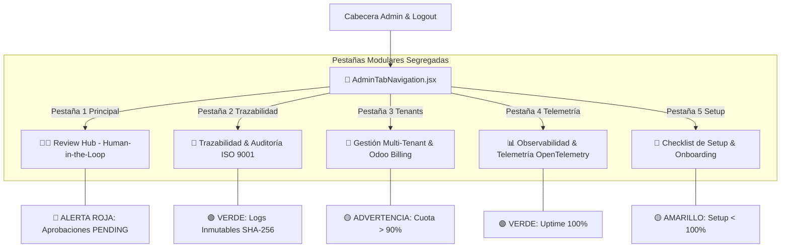

# 📜 SPEC: Rediseño Admin Hub — Navegación por 5 Pestañas & Sistema de Alertas Visuales
**ID:** SPEC-CORE-39  
**Épica Relacionada:** Admin Hub UX, Tab Navigation Governance, IAM Audit Trail & Event Severity Badge System  
**Issue Relacionado:** `#20` ([`[FEAT] Rediseño Admin Hub: Navegación por Pestañas & Sistema de Alertas Visuales`](https://github.com/onlyone-ai-pods/aipods-docs/issues/20))  
**Estado:** APPROVED / SPEC-DRIVEN  

---

## 1. Visión y Objetivos

Esta especificación establece la reestructuración del **Admin Review Hub** (`aipods-frontend-admin`) en un **Sistema de Navegación por 5 Pestañas Modulares** con **Indicadores de Alertas de Severidad por Color (Badge Alerts)**.

Garantiza la segregación de funciones (ISO 27001 / SOC 2 Type II):
1. **Pestaña 1 (Principal)**: Focus total en la toma de decisiones sobre la cola de aprobaciones en tiempo real **Human-in-the-Loop (`dry_run = true`)**.
2. **Pestaña 2 (Trazabilidad)**: Módulo segregado exclusivo para **Auditoría de Eventos Históricos (`AuditTrailLog.jsx`)** e IAM Audit Trail firmado con SHA-256.
3. **Pestañas 3, 4 y 5**: Gestión Multi-Tenant/Billing, Observabilidad/Telemetría y Checklist de Setup.

---

## 2. Arquitectura de Navegación de 5 Pestañas



---

## 3. Matriz Oficial de 5 Pestañas

| ID Pestaña | Nombre Sugerido (Label) | Icono | Componente Renderizado | Regla de Indicador de Severidad |
|---|---|:---:|---|---|
| **`tab-review`** *(Default)* | **Review Hub (Dry-Run)** | `🧑‍⚖️` | `SeniorReviewHub.jsx` & `AuditExportModal.jsx` | 🔴 **ROJO PULSANTE**: Acciones `dry_run` pendientes. |
| **`tab-audit`** *(Nueva)* | **Trazabilidad & Auditoría** | `📜` | `AuditTrailLog.jsx` | 🟢 **VERDE**: Trazabilidad e historial de eventos SHA-256. |
| **`tab-tenants`** | **Gestión Multi-Tenant** | `🏢` | `TenantManagementView.jsx` | 🟡 **AMARILLO**: Cuota $>90\%$ o `PENDING_PAYMENT`. |
| **`tab-telemetry`** | **Observabilidad** | `📊` | `TelemetryDashboard.jsx` & `FinOpsMetrics.jsx` | 🟢 **VERDE**: Latencia OK / 🔴 **ROJO**: Fallo en servidor. |
| **`tab-onboarding`** | **Checklist de Setup** | `🧙` | `AdminOnboardingWizard.jsx` | 🟡 **AMARILLO**: Si el progreso es $< 100\%$. |

---

## 4. Escenarios BDD

```gherkin
Feature: Rediseño Admin Hub — Navegación por 5 Pestañas Modulares

  Scenario: Segregación del Módulo de Trazabilidad e Auditoría
    Given un auditor o administrador en el Admin Hub
    When selecciona la pestaña `📜 Trazabilidad & Auditoría`
    Then el sistema muestra exclusivamente el componente `AuditTrailLog.jsx`
    And la pestaña `🧑‍⚖️ Review Hub` queda liberada para enfocarse únicamente en las decisiones Dry-Run
```
