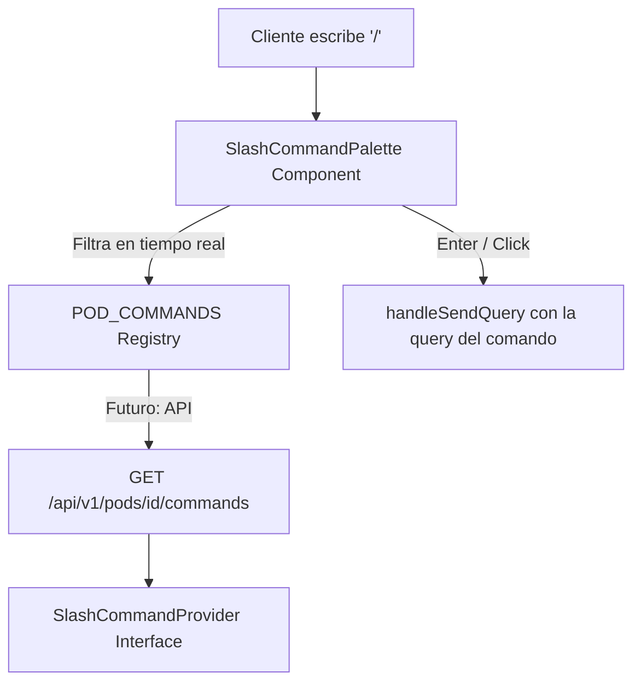

# 📜 SPEC: Slash Commands (`/`) — Command Palette para AI Pods
**ID:** SPEC-CORE-21  
**Épica Relacionada:** UX Customer Portal, Productividad & Discoverability  
**Estado:** IMPLEMENTED / SPEC-DRIVEN  

---

## 1. Visión y Objetivos

Esta especificación establece el patrón **Slash Commands** para la consola interactiva del Customer Portal. Al escribir `/` en el prompt del chat, se despliega un menú contextual (Command Palette) con las funcionalidades disponibles del AI Pod activo.

El patrón es **reutilizable**: cualquier AI Pod puede registrar sus propios Slash Commands implementando la interfaz `SlashCommandProvider` en Go.

---

## 2. Arquitectura



---

## 3. Registro de Comandos por Pod

### 3.1 Interfaz Go (Backend)

Cada Pod que quiera exponer Slash Commands debe implementar la interfaz `SlashCommandProvider`:

```go
type SlashCommand struct {
    Command     string `json:"command"`
    Label       string `json:"label"`
    Description string `json:"description"`
    Icon        string `json:"icon"`
    Category    string `json:"category"`
    Example     string `json:"example"`
}

type SlashCommandProvider interface {
    SlashCommands() []SlashCommand
}
```

### 3.2 Registro Frontend (React)

En el MVP, los comandos se registran estáticamente en `SlashCommandPalette.jsx`:

```javascript
const POD_COMMANDS = {
  POD_AFIP_FISCAL: [
    { command: '/puntos_de_venta', label: 'Puntos de Venta', ... },
    { command: '/monotributo', label: 'Estado de Cuenta Monotributo', ... },
    ...
  ],
  POD_GITHUB_DEVOPS: [
    { command: '/repos', label: 'Mis Repositorios', ... },
    ...
  ]
};
```

**POST-MVP:** Los comandos se cargarán dinámicamente via `GET /api/v1/pods/{podId}/commands`.

---

## 4. Convenciones de Naming

| Regla | Ejemplo |
|---|---|
| Usar `snake_case` | `/puntos_de_venta` ✔️, `/PuntosDeVenta` ❌ |
| Máximo 20 caracteres | `/retenciones` ✔️ |
| Prefijo `/` obligatorio | `/monotributo` ✔️ |
| Sin espacios | `/estado_cuenta` ✔️ |

---

## 5. Categorías Estándar

| Categoría | Uso |
|---|---|
| **Consultas** | Operaciones de lectura (listar, buscar, filtrar) |
| **Gestión** | Operaciones de escritura (alta, baja, modificación) |
| **Configuración** | Setup de certificados, credenciales, parámetros |
| **Sistema** | Ayuda, estado del pod, versión |

---

## 6. UX del Command Palette

| Feature | Descripción |
|---|---|
| Trigger `/` | Al escribir `/`, aparece el popup flotante sobre el input |
| Fuzzy Filter | Escribir `/mon` filtra a "Monotributo" |
| Teclado `↑↓` | Navegar entre comandos |
| `Enter` | Ejecutar comando seleccionado |
| `Esc` | Cerrar paleta sin ejecutar |
| Glassmorphism | Fondo con blur y bordes cyan |

---

## 7. Ejemplo Completo: POD_AFIP_FISCAL

| Comando | Label | Icono | Categoría |
|---|---|---|---|
| `/puntos_de_venta` | Puntos de Venta | 📍 | Consultas |
| `/monotributo` | Estado de Cuenta Monotributo | 🧾 | Consultas |
| `/retenciones` | Mis Retenciones / Percepciones | 📑 | Consultas |
| `/comprobantes` | Mis Comprobantes | 📄 | Consultas |
| `/certificado` | Generar CSR / Certificado | 🔐 | Configuración |
| `/ayuda` | Ayuda del Pod | ❓ | Sistema |

---

## 8. Escenario BDD

```gherkin
Given un usuario en la consola del Sandbox con el Pod AFIP/ARCA activo
When el usuario escribe "/" en el prompt del chat
Then el sistema debe mostrar una Command Palette flotante con los 6 comandos del Pod
And al escribir "/mon" la lista se filtra a "Monotributo"
And al presionar Enter, se ejecuta la consulta de Estado de Cuenta Monotributo
```
