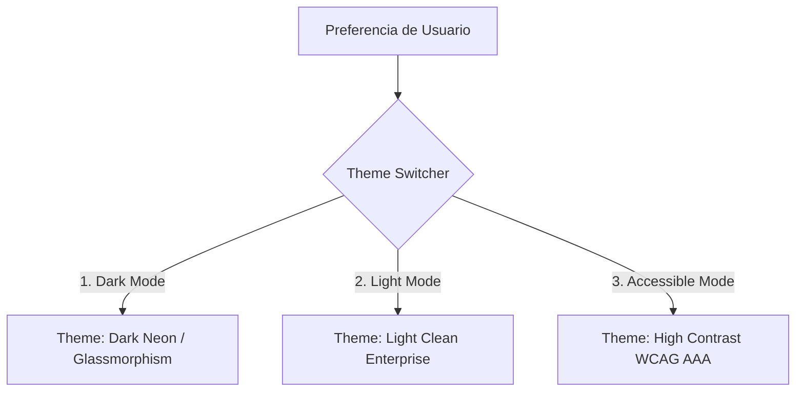

# 📜 SPEC: 3-Tier Theme System, Enterprise Iconography & Accessibility Standard
**ID:** SPEC-CORE-22  
**Épica Relacionada:** UX/UI Design System, Brand Protection & Accessibility (WCAG 2.1 AAA)  
**Estado:** APPROVED / SPEC-DRIVEN  

---

## 1. Visión y Objetivos

Esta especificación establece la estrategia de **3 Temas Visuales Integrados** y el **Sistema de Iconografía Vectorial Propietaria** para todo el ecosistema SaaS de **Be OnlyOne / AI Pods**.

Su propósito es equilibrar dos metas fundamentales:
1. **Impacto Visual Deslumbrante ("WOW Factor"):** Proporcionar interfaces modernas con neones, glassmorphism y micro-animaciones para el uso habitual.
2. **Cumplimiento de Accesibilidad Universal (WCAG 2.1 AAA) & Seguridad de IP:** Ofrecer un modo dedicado de alta accesibilidad para usuarios con necesidades visuales específicas, asegurando que el 100% de los activos vectoriales estén libres de infracciones de marcas o propiedad intelectual de terceros.

---

## 2. Arquitectura de los 3 Temas Visuales

El sistema soporta 3 modos seleccionables por el usuario o detectados mediante preferencias del sistema (`prefers-color-scheme`, `prefers-contrast`):



### 2.1 Detalle de Temas

| Tema | Nombre | Enfoque Estético | Paleta Principal | Características clave |
|---|---|---|---|---|
| **`dark`** | **Dark Neon (Default)** | Cyber / SaaS de vanguardia | `#0F172A`, `#00F2FE`, `#4FACFE` | Glassmorphism, resplandor cyan/verde neón, gradientes suaves, alto impacto visual. |
| **`light`** | **Light Clean** | Enterprise Sobrio | `#F8FAFC`, `#FFFFFF`, `#0284C7` | Fondo claro pulido, trazos oscuros nítidos, sombreados sutiles. |
| **`accessible`**| **Accessibility Friendly** | WCAG 2.1 AAA | `#000000`, `#FFFFFF`, `#FFFF00` | Ultra-alto contraste (≥ 7:1), sin transparencias/gradientes, formas e íconos auto-explicativos seguros para daltónicos. |

---

## 3. Tokens de Diseño CSS (Theme Switching)

Todos los componentes e íconos consumen tokens dinámicos en CSS. El cambio de tema solo modifica los valores de las variables globales sin re-renderizar la lógica del componente:

```css
/* 1. DARK NEON (DEFAULT) */
[data-theme="dark"] {
  --bg-primary: #0f172a;
  --bg-card: rgba(30, 41, 59, 0.7);
  --text-primary: #e2e8f0;
  --brand-cyan: #00f2fe;
  --brand-blue: #4facfe;
  --status-success: #34d399;
  --status-danger: #f87171;
  --border-card: rgba(0, 242, 254, 0.15);
  --glass-blur: blur(12px);
}

/* 2. LIGHT CLEAN */
[data-theme="light"] {
  --bg-primary: #f8fafc;
  --bg-card: #ffffff;
  --text-primary: #0f172a;
  --brand-cyan: #0284c7;
  --brand-blue: #0369a1;
  --status-success: #059669;
  --status-danger: #dc2626;
  --border-card: rgba(15, 23, 42, 0.1);
  --glass-blur: none;
}

/* 3. ACCESSIBILITY FRIENDLY (HIGH CONTRAST WCAG AAA) */
[data-theme="accessible"] {
  --bg-primary: #000000;
  --bg-card: #000000;
  --text-primary: #ffffff;
  --brand-cyan: #ffff00; /* Amarillo de Alto Contraste */
  --brand-blue: #ffffff;
  --status-success: #00ff00;
  --status-danger: #ff0000;
  --border-card: #ffffff;
  --glass-blur: none;
}
```

---

## 4. Estándar de Iconografía Vectorial Propietaria

Para prevenir riesgos de propiedad intelectual y garantizar escalabilidad:

1. **Vectores SVG Nativa Limpios:** Todos los íconos se construyen como código SVG Inline o componentes React exportables.
2. **Propiedad `currentColor`:** Los íconos no hardcodean colores de línea o relleno; se adaptan dinámicamente según la variable del tema en curso.
3. **Doble Indicación de Estado (Color + Forma):** Para usuarios daltónicos en el tema `accessible`:
   - *Éxito / Útil:* Relleno o borde Verde + Marcador Check `✓`
   - *Error / Cuestionado:* Relleno o borde Rojo + Cruz `✕` o Exclamación `!`
4. **Semántica Accessible:** Todos los SVGs contienen los atributos `role="img"` y `aria-label` descriptivo.

---

## 5. Matriz de Iconografía de Ecosistema

| Módulo / Función | Ícono Vectorial | Atributo Semántico | Comportamiento Reacción |
|---|---|---|---|
| **Certificado Digital** | Escudo + Documento + Candado | `aria-label="Certificado Digital"` | Resalta borde en hover |
| **Slash Commands (`/`)** | Teclado con Tecla Slash activada | `aria-label="Atajos de Teclado"` | Brillo neón al escribir `/` |
| **Monotributo** | Recibo de Cuota + Sello Check | `aria-label="Estado de Cuenta Monotributo"` | Muestra badge de cuota al día |
| **Puntos de Venta** | Pin de Ubicación sobre Grilla | `aria-label="Puntos de Venta ARCA"` | Despliega sucursales activas |
| **Feedback Positivo (👍)** | Thumbs Up Vectorial | `aria-label="Respuesta Útil"` | Relleno esmeralda + Animación pulso |
| **Feedback Negativo (👎)** | Thumbs Down Vectorial | `aria-label="Respuesta No Útil"` | Relleno coral + Abre modal de causas |

---

## 6. Escenarios BDD

```gherkin
Given un usuario navegando en el Customer Portal de AI Pods
When selecciona la opción de tema "Accessibility Friendly" en la configuración
Then el sistema aplica inmediatamente el conjunto de variables CSS [data-theme="accessible"]
And todos los gradientes y transparencias glassmorphism son reemplazados por bordes sólidos de alto contraste (≥ 7:1)
And los íconos de feedback incorporan símbolos inequívocos de forma (✓ y ✕) junto al color
```
