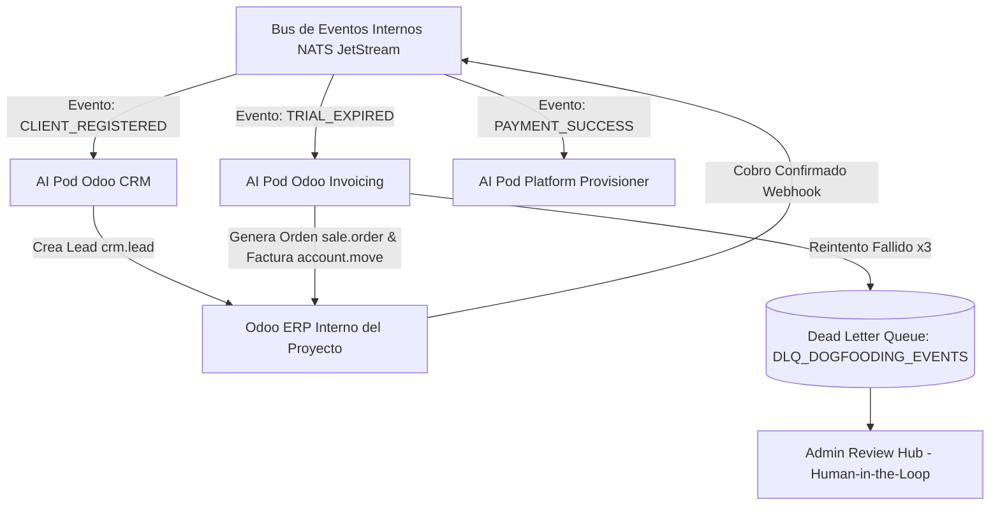

# 📜 SPEC: Arquitectura de Autoconsumo (Dogfooding) para CRM, Facturación y Cobranza Recurrente

**ID:** `SPEC-CORE-22`  
**Épica Relacionada:** Autoconsumo de AI Pods, Integración Odoo ERP, CRM & Facturación SaaS  
**Versión:** `9.0.0`  
**Estado:** AUDITADO & LISTO PARA IMPLEMENTACIÓN  

---

## 1. Visión y Objetivos

Esta especificación establece la arquitectura de **Autoconsumo / Dogfooding ("Usar nuestro propio producto")**. La plataforma SaaS consumirá sus propios AI Pods especializados (Pod Odoo CRM, Pod Odoo Invoicing/Finance y Pod EvoCRM) para registrar leads de clientes, facturar consumos y gestionar la cobranza post-periodo de prueba de forma automatizada.

---

## 2. Arquitectura de Autoconsumo Basada en Eventos (NATS JetStream)



---

## 3. Esquema Estricto JSON de los Eventos en NATS

### 3.1 Evento `CLIENT_REGISTERED`
```json
{
  "event_id": "evt_reg_12345",
  "event_type": "CLIENT_REGISTERED",
  "tenant_id": "tenant_acme_corp",
  "customer_email": "owner@acme.com",
  "customer_name": "Acme Corp",
  "country": "AR",
  "channel": "SANDBOX_TRIAL",
  "timestamp": "2026-07-25T00:31:00Z"
}
```

### 3.2 Evento `TRIAL_EXPIRED`
```json
{
  "event_id": "evt_exp_67890",
  "event_type": "TRIAL_EXPIRED",
  "tenant_id": "tenant_acme_corp",
  "tokens_consumed": 52400,
  "free_quota": 50000,
  "billable_tokens": 2400,
  "amount_due_usd": 15.50,
  "timestamp": "2026-07-25T00:31:00Z"
}
```

### 3.3 Evento `PAYMENT_SUCCESS`
```json
{
  "event_id": "evt_pay_99999",
  "event_type": "PAYMENT_SUCCESS",
  "tenant_id": "tenant_acme_corp",
  "invoice_id": "INV-2026-0089",
  "amount_paid_usd": 15.50,
  "payment_method": "STRIPE",
  "timestamp": "2026-07-25T00:31:00Z"
}
```

---

## 4. Especificación de los Flujos Operativos de Autoconsumo

### 4.1 Flujo A: Registro de Lead & Oportunidad en CRM (`CLIENT_REGISTERED`)
1. **Disparo del Evento:** Cuando un usuario completa el registro en la Landing o interactúa con el Sandbox, el API Gateway en Go emite el evento `CLIENT_REGISTERED` a NATS.
2. **Consumo por AI Pod Odoo CRM:**  
   El **Pod Odoo CRM** procesa el mensaje e invoca la herramienta de integración con Odoo ERP (`crear_oportunidad_crm` con `dry_run = false`).
3. **Registro en Odoo ERP:**  
   Se crea automáticamente un registro en el modelo `crm.lead` de Odoo asignando la fuente del lead (*Sandbox / Web Trial*), el país y el interés inicial del cliente.

### 4.2 Flujo B: Cobranza & Facturación Recurrente Post-Trial (`TRIAL_EXPIRED`)
1. **Medición FinOps & Disparo:** Al cumplirse los 14 días de prueba o consumirse los 50,000 tokens gratis, el motor de FinOps emite el evento `TRIAL_EXPIRED`.
2. **Consumo por AI Pod Odoo Invoicing:**  
   El **Pod Odoo Invoicing / Finance** calcula el consumo de tokens adicionales, genera la orden de venta (`sale.order`) y emite la factura electrónica (`account.move`).
3. **Despacho del Enlace de Pago:**  
   El Pod invoca a **EvoCRM** para enviar el link de cobro (Stripe / MercadoPago) por **WhatsApp** y a **Amazon SES** para enviarlo por Email.

### 4.3 Flujo C: Activación Automática de Suscripción (`PAYMENT_SUCCESS`)
1. Al confirmarse el pago en la pasarela, la webhook de Odoo emite el evento `PAYMENT_SUCCESS`.
2. El **Pod Platform Provisioner** conmuta el perfil del tenant de `TRIAL_ACTIVE` a `PROD_ACTIVE`, actualizando las cuotas de tokens y notificando al cliente.

---

## 5. Resiliencia & Manejo de Errores (Dead Letter Queue)

* **Reintentos Concurrenciales:** Se ejecutan hasta 3 reintentos con retraso exponencial (1s, 5s, 25s).
* **Derivación a DLQ:** Si la API de Odoo ERP o WhatsApp no responde tras 3 reintentos, el mensaje se redirige a la cola `DLQ_DOGFOODING_EVENTS` y genera una alerta de aprobación manual en el **Senior Review Hub** (`aipods-frontend-admin`).

---

## 6. Escenario BDD de Autoconsumo CRM y Facturación

```gherkin
Característica: Autoconsumo Dogfooding para CRM y Facturación Odoo

  Escenario: Registro automático de Lead en Odoo CRM al registrarse cliente
    Dado que un nuevo cliente completa el registro en la Landing Page
    Cuando el API Server emite el evento "CLIENT_REGISTERED" a NATS JetStream
    Entonces el AI Pod Odoo CRM procesa el evento en menos de 500 ms
    Y crea un lead en el modelo "crm.lead" de Odoo ERP

  Escenario: Expiración de Trial y generación de Factura en Odoo Invoicing
    Dado un cliente cuyo periodo de prueba gratis de 14 días ha vencido
    Cuando el motor de FinOps emite el evento "TRIAL_EXPIRED"
    Entonces el AI Pod Odoo Invoicing calcula el consumo de tokens
    And invoca a Odoo ERP para generar la orden de venta "sale.order" y factura "account.move"
    And envía el enlace de pago al cliente por WhatsApp vía EvoCRM y por Email vía Amazon SES
    And al confirmarse el pago "PAYMENT_SUCCESS", actualiza el estado del tenant a PROD_ACTIVE en < 1,000 ms
```
