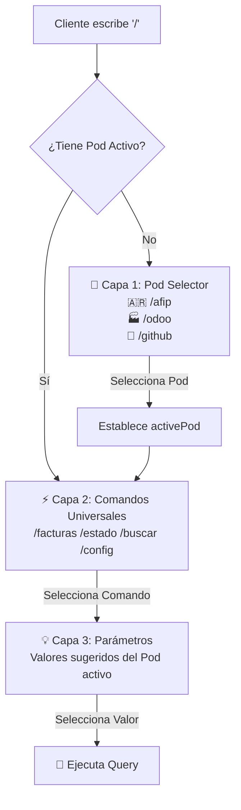

# 📜 SPEC: Multi-Pod Context Switcher & Universal Commands
**ID:** SPEC-CORE-23  
**Épica Relacionada:** UX Customer Portal, Multi-Pod Orchestration & Discoverability  
**Estado:** IMPLEMENTED / SPEC-DRIVEN  
**Depende de:** SPEC-CORE-21 (Slash Commands)

---

## 1. Visión y Objetivos

Esta especificación evoluciona el patrón Slash Commands (SPEC-CORE-21) para soportar **múltiples AI Pods activos simultáneamente** en una misma sesión del Customer Portal.

### Problema Resuelto
En un entorno Enterprise SaaS donde un cliente puede tener múltiples AI Pods activos (ej. AFIP, Odoo, GitHub DevOps), tener comandos duplicados o específicos por Pod (ej. `/facturas_odoo`, `/facturas_afip`) genera:
- Fricción cognitiva y confusión del usuario.
- Comandos largos y difíciles de recordar.
- Escalabilidad limitada al agregar nuevos Pods.

### Solución
Arquitectura en **3 capas** para el prompt:
1. **Capa 1 — Pod Selector**: Al escribir `/` sin Pod activo, se muestran los Pods disponibles.
2. **Capa 2 — Comandos Universales**: Comandos genéricos (`/facturas`, `/estado`, `/buscar`, `/config`) que se comportan según el Pod activo.
3. **Capa 3 — Sugerencia de Parámetros**: Autocompletado inteligente contextualizado al Pod.

---

## 2. Arquitectura



---

## 3. Registro de Pods (POD_REGISTRY)

| Pod ID | Shortcut | Ícono | Color | Descripción |
|---|---|---|---|---|
| `POD_AFIP_FISCAL` | `/afip` | 🇦🇷 | `#00f2fe` | AFIP / ARCA — Fiscal Argentina |
| `POD_ODOO_ENTERPRISE` | `/odoo` | 🏭 | `#714B67` | Odoo Enterprise ERP |
| `POD_GITHUB_DEVOPS` | `/github` | 🐙 | `#238636` | GitHub & Odoo.sh DevOps |

---

## 4. Comandos Universales por Pod

Los comandos son **genéricos y memorables**. Su comportamiento cambia según el Pod activo:

| Comando | AFIP | Odoo | GitHub DevOps |
|---|---|---|---|
| `/facturas` | Comprobantes emitidos/recibidos ARCA | Facturas Odoo (borrador/publicadas) | — |
| `/estado` | Estado de Cuenta Monotributo | Partner Ledger / Saldo | Estado CI/CD |
| `/buscar` | Buscar Puntos de Venta | — | — |
| `/ventas` | — | Órdenes de Venta (presupuestos/confirmadas) | — |
| `/stock` | — | Inventario y Productos | — |
| `/repos` | — | — | Repositorios |
| `/deployments` | — | — | Despliegues Odoo.sh |
| `/pull_requests` | — | — | PRs pendientes |
| `/retenciones` | Retenciones/Percepciones SICORE | — | — |
| `/config` | Certificados CSR AFIP | Webhooks / API Keys Odoo | Secrets / Webhooks |
| `/ayuda` | Ayuda del Pod AFIP | Ayuda del Pod Odoo | Ayuda del Pod DevOps |

---

## 5. Convenciones de UX

### 5.1 Cambio de Contexto de Pod
- Al escribir `/` sin Pod activo, se muestran los Pods disponibles con sus colores de marca.
- Al seleccionar un Pod, se muestra un **mensaje de sistema** confirmando el cambio de contexto.
- En la barra de estado del chat se muestra un **badge de contexto activo** con el ícono y color del Pod.

### 5.2 Navegación por Teclado
| Tecla | Acción |
|---|---|
| `↑ ↓` | Navegar entre opciones |
| `Enter` | Seleccionar Pod / Comando / Parámetro |
| `Tab` | Autocompletar valor seleccionado |
| `Esc` | Cerrar paleta |
| `Backspace` en `/` | Volver al selector de Pods |

### 5.3 Badge de Contexto Activo
El badge se muestra en la barra de estado del Sandbox y dentro de la paleta de comandos, con el color corporativo del Pod activo:
- 🇦🇷 AFIP/ARCA → Cyan (`#00f2fe`)
- 🏭 Odoo ERP → Morado Odoo (`#714B67`)
- 🐙 GitHub DevOps → Verde GitHub (`#238636`)

---

## 6. Estructura de Datos

### 6.1 Backend Go (Interfaz)

```go
// pod.go — SlashCommandProvider (SPEC-CORE-21)
type SlashCommand struct {
    Command     string   `json:"command"`
    Label       string   `json:"label"`
    Description string   `json:"description"`
    Icon        string   `json:"icon"`
    Category    string   `json:"category"`
    ParamHint   string   `json:"param_hint,omitempty"`
    SuggestedValues []SuggestedValue `json:"suggested_values,omitempty"`
}

type SuggestedValue struct {
    Value string `json:"value"`
    Label string `json:"label"`
    Badge string `json:"badge"`
}
```

### 6.2 Frontend React (Registry)

```javascript
// SlashCommandPalette.jsx
const POD_REGISTRY = [
  { id: 'POD_AFIP_FISCAL', label: 'AFIP / ARCA', shortcut: 'afip', icon: '🇦🇷', color: '#00f2fe' },
  { id: 'POD_ODOO_ENTERPRISE', label: 'Odoo Enterprise', shortcut: 'odoo', icon: '🏭', color: '#714B67' },
  { id: 'POD_GITHUB_DEVOPS', label: 'GitHub DevOps', shortcut: 'github', icon: '🐙', color: '#238636' }
];

const UNIVERSAL_COMMANDS = {
  POD_AFIP_FISCAL: [ /* ... */ ],
  POD_ODOO_ENTERPRISE: [ /* ... */ ],
  POD_GITHUB_DEVOPS: [ /* ... */ ]
};
```

**POST-MVP:** Los registros se cargarán dinámicamente via `GET /api/v1/pods` y `GET /api/v1/pods/{id}/commands`.

---

## 7. Escenarios BDD

```gherkin
Scenario: Cambio de contexto de Pod
  Given un usuario en la consola del Sandbox sin Pod activo
  When el usuario escribe "/" en el prompt del chat
  Then el sistema muestra la lista de Pods disponibles (AFIP, Odoo, GitHub)
  And al seleccionar "🏭 /odoo", el contexto cambia a POD_ODOO_ENTERPRISE
  And se muestra un badge "🏭 Odoo Enterprise ERP" en la barra de estado

Scenario: Comandos universales contextualizados
  Given el Pod activo es "POD_ODOO_ENTERPRISE"
  When el usuario escribe "/facturas"
  Then se muestran los parámetros de Odoo: borrador, publicadas, adeudadas, hoy
  And NO se muestran parámetros de AFIP (emitidas, recibidas)

Scenario: Cambio de Pod con Backspace
  Given el Pod activo es "POD_AFIP_FISCAL"
  And el usuario escribe "/" en el prompt
  When el usuario presiona Backspace
  Then el contexto de Pod se resetea a null
  And se muestra nuevamente el selector de Pods
```
