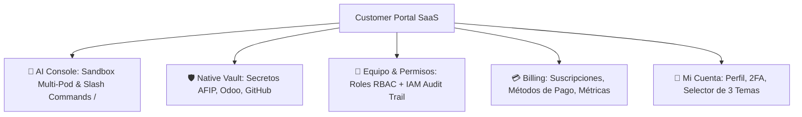

# 📜 SPEC: Customer Portal Architecture — Native Vault, RBAC, Billing & IAM Audit Trail
**ID:** SPEC-CORE-24  
**Épica Relacionada:** UX Customer Portal, Enterprise Security, IAM Governance (ISO 9001 & SOC 2 Type II)  
**Estado:** APPROVED / SPEC-DRIVEN  

---

## 1. Visión y Objetivos

Esta especificación establece la arquitectura completa del **Customer Portal (Portal del Cliente)** para la plataforma SaaS de **Be OnlyOne / AI Pods**.

Supera las limitaciones de los modelos monolíticos tradicionales integrando una arquitectura de **Identidad Unificada desacoplada de la Entidad Comercial**, con soporte completo para:
1. **Gestión de Secretos en Vault Nativo & BYOV Bitwarden** (`/vault`).
2. **Administración de Equipo y Control de Acceso Granular (RBAC/ABAC)** (`/team`).
3. **Registro Inmutable de Alteración de Permisos (IAM Audit Trail)** (`/team/audit`).
4. **Facturación, Métricas de Consumo y Suscripciones** (`/billing`).
5. **Perfil Personal, Seguridad 2FA y Preferencias de Tema** (`/settings`).

---

## 2. Estructura de Navegación del Customer Portal

El portal se organiza en **5 Módulos Principales** con soporte nativo para los 3 temas visuales (*Dark Neon, Light Clean, Accessibility Friendly*):



---

## 3. Módulo 1: Vault Nativo de Credenciales & Secretos (`/vault`)

### 3.1 Modalidades de Custodia (SPEC-CORE-29)
El cliente puede seleccionar entre dos modos de almacenamiento:
- **Vault Nativo de Plataforma**: Cifrado simétrico **AES-256 GCM** por tenant.
- **BYOV (Bring Your Own Vault / Bitwarden Secrets Manager)**: Consulta efímera en memoria RAM volátil sin almacenamiento de claves en disco.

### 3.2 Tarjetas de Credenciales por Pod
- 🇦🇷 **AFIP / ARCA**: CUIT, Clave Fiscal, Carga de Certificado `.crt` y Clave Privada `.key`.
- 🏭 **Odoo ERP**: URL de Instancia, Nombre de BD, API Key / Master Password.
- 🐙 **GitHub / DevOps**: Personal Access Token (`ghp_...`), SSH Keys, Odoo.sh Token.

---

## 4. Módulo 2: Administración de Equipo, Roles y Permisos (`/team`)

### 4.1 Modelo de Datos Superador (Unified Identity + ReBAC)

A diferencia del modelo monolítico de Odoo (`res.partner` + `res.users`), desacoplamos la Identidad del Usuario de la Entidad Fiscal:
- **AuthUser**: Identidad universal para autenticación JWT de alta velocidad en Go.
- **Organization / Tenant**: Razón Social, CUIT y datos de facturación.
- **Tenant Membership**: Relación 1-a-Muchos que permite a un usuario pertenecer a múltiples empresas/tenants con diferentes roles.

### 4.2 Matriz de Roles
| Rol | Nombre | Descripción de Permisos |
|---|---|---|
| `TENANT_OWNER` | 👑 Administrador | Acceso total a la empresa, pagos, gestión de usuarios, vault y pods. |
| `OPERATOR` | 💼 Operador | Acceso a interactuar con los Pods y ejecutar Dry-Run según permisos asignados. |
| `AUDITOR` | 👁️ Auditor | Solo lectura de logs de chat, auditoría ISO 9001 e historial de permisos. |

### 4.3 Matriz Visual de Permisos por Pod (Grid UI)
Permite activar/desactivar en tiempo real casilleros de acceso a comandos o funciones específicas de cada Pod para cada colaborador.

---

## 5. Módulo 3: Registro Inmutable de Alteración de Permisos (IAM Audit Trail) (`/team/audit`)

### 5.1 Invariante de Seguridad
Cualquier modificación en los roles, permisos o estados de acceso genera una entrada **append-only e inmutable** firmada con un hash SHA-256. Ningún usuario ni administrador puede editar o borrar estos registros.

### 5.2 Estructura del Log de Auditoría de Permisos (JSON)

```json
{
  "audit_id": "aud_perm_9f8a7b6c5d4e",
  "timestamp": "2026-07-30T21:35:00Z",
  "tenant_id": "tenant_acme_corp",
  "actor": {
    "user_id": "usr_owner_01",
    "email": "martin.silva@acmecorp.com",
    "role": "TENANT_OWNER",
    "ip_address": "190.210.45.12"
  },
  "target_user": {
    "user_id": "usr_op_42",
    "email": "laura.gomez@acmecorp.com",
    "role": "OPERATOR"
  },
  "action_type": "PERMISSION_GRANTED",
  "changes": [
    {
      "pod_id": "POD_AFIP_FISCAL",
      "permission": "config_certificates",
      "previous_state": "DENIED",
      "new_state": "GRANTED",
      "risk_level": "CRITICAL"
    }
  ],
  "integrity_hash": "e3b0c44298fc1c149afbf4c8996fb92427ae41e4649b934ca495991b7852b855"
}
```

### 5.3 Inspector Visual de Cambios (Diff UI)
Permite comparar en pantalla el estado anterior vs. el estado nuevo (Before / After Payload) y exportar evidencia en PDF/CSV para auditorías ISO 27001 o SOC 2.

---

## 6. Módulo 4: Facturación & Suscripción (`/billing`)

- **Resumen de Suscripción**: Tier activo (ej. *Enterprise Multi-Pod Plan*).
- **Métricas de Consumo**: Gráfico de tokens consumidos y llamadas ejecutadas en AFIP / Odoo.
- **Gestión de Métodos de Pago**: Tarjetas de crédito, débito o transferencias integradas.
- **Historial de Comprobantes**: Facturas emitidas por la plataforma descargables en PDF.

---

## 7. Módulo 5: Perfil Personal, Seguridad & Preferencias (`/settings`)

- **Perfil de Usuario**: Nombre, cargo, email, avatar.
- **Seguridad**: Cambio de contraseña y autenticación de doble factor (**2FA / MFA** via TOTP QR Code).
- **Preferencias del Sistema**: Switcher de los 3 Temas Visuales (SPEC-CORE-22):
  - 🌙 *Dark Neon* (Default)
  - ☀️ *Light Clean*
  - ♿ *Accessibility Friendly* (WCAG 2.1 AAA)

---

## 8. Escenarios BDD

```gherkin
Feature: Gobernanza de Permisos y Registro de Auditoría IAM

  Scenario: Modificación de Permisos con Registro Inmutable
    Given un Administrador (TENANT_OWNER) en el módulo /team
    When otorga el permiso de "Configuración de Certificados AFIP" al usuario "laura.gomez@acme.com"
    Then el sistema debe actualizar la matriz de permisos
    And registrar una entrada inmutable en el IAM Audit Trail con hash SHA-256
    And enviar una alerta por correo a todos los Owners de la empresa indicando el cambio de riesgo ALTO

  Scenario: Intento de Eliminación de Registros de Auditoría
    Given un usuario intentando borrar registros del historial de permisos
    Then la plataforma debe denegar la acción con error HTTP 403 Forbidden
    And notificar la violación de seguridad en los logs de auditoría
```
