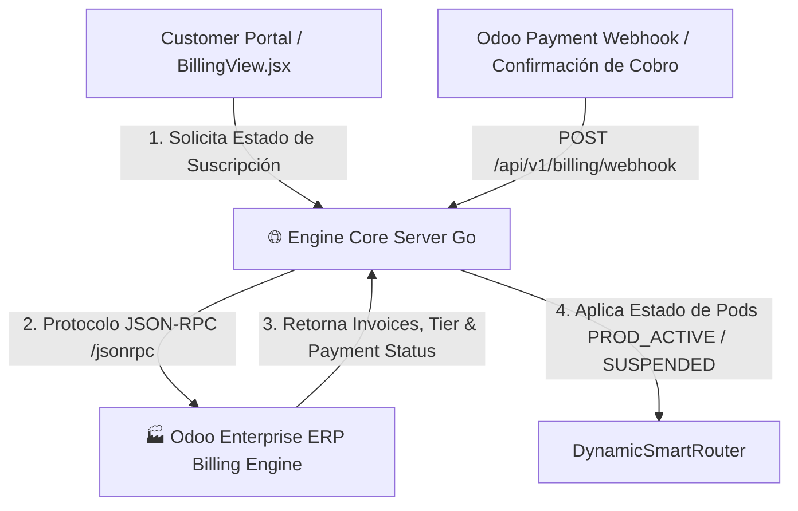

# 📜 SPEC: Integración JSON-RPC Odoo Billing, Aprovisionamiento PROD_ACTIVE & Métricas
**ID:** SPEC-CORE-26  
**Épica Relacionada:** Customer Portal Growth, Monetización SaaS & Odoo ERP Billing Integration  
**Issue Relacionado:** `#8` ([`[FEAT] Integración JSON-RPC Odoo Billing: Confirmación de Pagos y Aprovisionamiento PROD_ACTIVE`](https://github.com/onlyone-ai-pods/aipods-docs/issues/8))  
**Estado:** APPROVED / SPEC-DRIVEN  

---

## 1. Visión y Objetivos

Esta especificación define la arquitectura de integración entre el **Customer Portal / Core Engine Go** y la plataforma de facturación basada en **Odoo Enterprise Billing**.

Permite sincronizar de manera automática la confirmación de pagos, facturas emitidas y la activación o suspensión automática del estado **`PROD_ACTIVE`** de los AI Pods contratados por cada Tenant.

---

## 2. Arquitectura de Integración JSON-RPC



---

## 3. Protocolo de Comunicación JSON-RPC 2.0

### 3.1 Solicitud de Autenticación & Consulta de Suscripción (`/jsonrpc`)

```json
{
  "jsonrpc": "2.0",
  "method": "call",
  "params": {
    "service": "object",
    "method": "execute_kw",
    "args": [
      "acme_billing_db",
      2,
      "admin_password",
      "sale.order",
      "search_read",
      [[["partner_id.vat", "=", "30711234568"], ["state", "=", "sale"]]],
      {"fields": ["name", "amount_total", "order_line", "subscription_state"]}
    ]
  },
  "id": 1
}
```

---

## 4. Ciclo de Vida de Suscripción & Estado del Tenant

| Estado de Suscripción | Comportamiento del Engine Go | Indicador UI en Portal |
|---|---|---|
| **`PROD_ACTIVE`** | Pods 100% operativos. Permite peticiones sin restricciones. | 🟢 **Suscripción Activa** |
| **`PENDING_PAYMENT`** | Periodo de gracia de 5 días. Advertencia en banner. | 🟡 **Pago Pendiente** |
| **`SUSPENDED`** | Bloqueo de peticiones HTTP 402 Payment Required. | 🔴 **Servicio Suspendido** |

---

## 5. Módulo Visual del Portal (`BillingView.jsx`)

Muestra en el Customer Portal (`/billing`):
1. **Plan & Estado Activo**: *Enterprise Multi-Pod Plan* (`PROD_ACTIVE`).
2. **Métricas de Consumo**: Gráfico de tokens consumidos en el mes y consultas ejecutadas.
3. **Historial de Facturas**: Lista de comprobantes emitidos en Odoo con botón para descargar PDF.
4. **Métodos de Pago**: Tarjeta de Crédito, Transferencia Bancaria y MercadoPago / Stripe.

---

## 6. Escenarios BDD

```gherkin
Feature: Integración JSON-RPC Odoo Billing & Aprovisionamiento PROD_ACTIVE

  Scenario: Aprovisionamiento Automático de Pods al Confirmar Pago
    Given un tenant en estado PENDING_PAYMENT
    When Odoo Billing emite el Webhook de confirmación de pago
    Then el motor Go debe actualizar el estado del tenant a PROD_ACTIVE
    And habilitar el enrutamiento full de peticiones en el DynamicSmartRouter

  Scenario: Intento de Uso de Pods en Estado Suspendido
    Given un tenant en estado SUSPENDED por falta de pago
    When el usuario intenta enviar una consulta desde el Customer Portal
    Then el servidor Go debe retornar un error HTTP 402 Payment Required
    And mostrar el modal de renovación de suscripción en el portal
```
