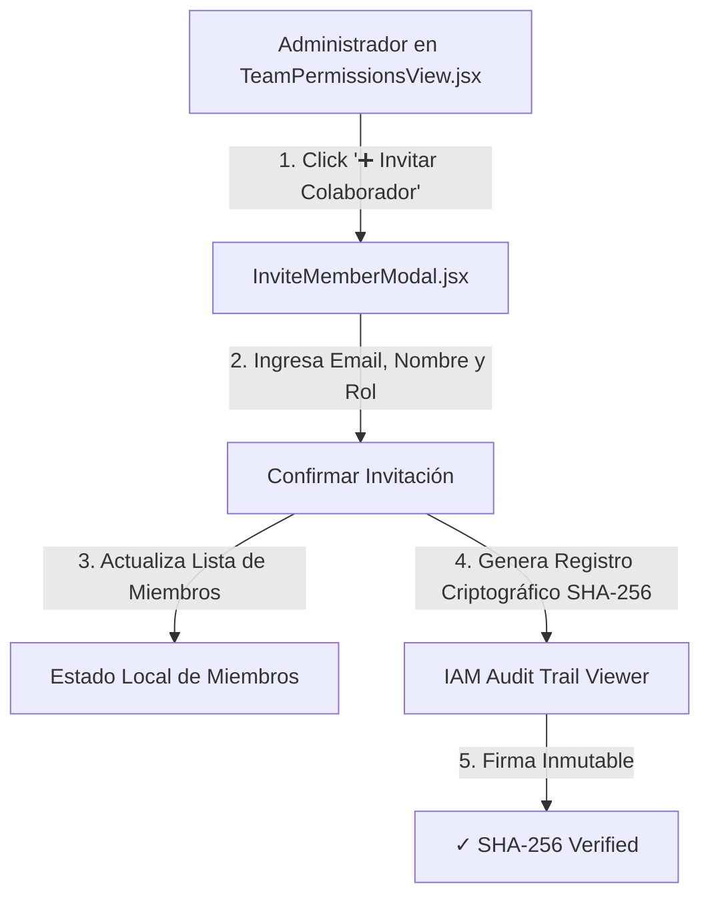

# 📜 SPEC: Invitación de Colaboradores RBAC & Panel de Perfil / 2FA en Customer Portal
**ID:** SPEC-CORE-31  
**Épica Relacionada:** Customer Portal Growth, ReBAC Governance & Identity Security  
**Issue Relacionado:** `#17` ([`[FEAT] Customer Portal: Modal de Invitaciones de Empleados con Asignación de Roles RBAC`](https://github.com/onlyone-ai-pods/aipods-docs/issues/17))  
**Estado:** APPROVED / SPEC-DRIVEN  

---

## 1. Visión y Objetivos

Esta especificación establece el flujo completo de **Gestión de Invitaciones de Empleados, Asignación Granular de Roles (RBAC)** y el **Panel de Perfil de Usuario con Autenticación de Dos Factores (2FA TOTP)** dentro del **Customer Portal** (`aipods-frontend-customer`).

Permite a los administradores de empresa:
1. Invitar nuevos colaboradores especificando Email, Nombre y Rol (*Admin, Operator, Viewer, Auditor*).
2. Inyectar automáticamente el registro de alteración en el **IAM Audit Trail** con firma SHA-256 inmutable (ISO 27001 / SOC 2).
3. Configurar su perfil de usuario, cambiar contraseñas y vincular autenticadores 2FA TOTP (Google Authenticator / Authy) mediante código QR.

---

## 2. Flujo de Invitación & Firma IAM Audit Trail



---

## 3. Matriz de Roles Asignables

| Rol | Permisos asignados por defecto |
|---|---|
| **Admin** | Acceso total a Consola, Vault, Gestión de Equipo y Facturación. |
| **Operator** | Acceso a Consola Multi-Pod y ejecuciones Dry-Run. |
| **Viewer** | Acceso de solo lectura a la consola (sin mutaciones). |
| **Auditor** | Acceso exclusivo al IAM Audit Trail y expedientes de auditoría ISO 9001. |

---

## 4. Módulo de Configuración de Perfil & 2FA (`SettingsView.jsx`)

Ubicado en `/settings`:
- **Datos de Cuenta**: Nombre, Email, Razón Social del Tenant y Avatar del cliente.
- **Seguridad 2FA TOTP**: Toggle de activación con renderizado de código QR para escaneo con aplicación de autenticación.
- **Preferencias de Interfaz**: Configuración por defecto del selector de 3 temas (*Dark Neon, Light Clean, Accessibility Friendly*).

---

## 5. Escenarios BDD

```gherkin
Feature: Invitación de Colaboradores RBAC & Configuración 2FA

  Scenario: Invitación de un Nuevo Operador con Registro SHA-256
    Given un usuario Administrador en la vista de Equipo
    When completa el formulario de invitación con `operador@acmecorp.com` y Rol `Operator`
    Then el sistema agrega el nuevo miembro a la tabla de colaboradores
    And genera una nueva entrada en el IAM Audit Trail con hash SHA-256 inalterable

  Scenario: Activación de Autenticación de Dos Factores (2FA)
    Given un usuario en la vista de Configuración `/settings`
    When presiona "Vincular 2FA Authenticator"
    Then el sistema debe mostrar un código QR dinámico
    And solicitar un código de verificación OTP de 6 dígitos
```
